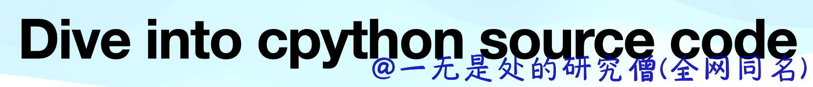

# dive-into-cpython

## Cpython 虚拟机中常用数据结构实现（objects）
- [深入理解 Python 虚拟机：列表（list）的实现原理及源码剖析](objects/01list.md)
- [深入理解 Python 虚拟机：元组（tuple）的实现原理及源码剖析](objects/02tuple.md)
- [深入理解 Python 虚拟机：浮点数（float）的实现原理及源码剖析](objects/03float.md)
- [深入理解 Python 虚拟机：整型（int）的实现原理及源码剖析](objects/04long.md)
- [深入理解 Python 虚拟机：复数（complex）的实现原理及源码剖析](objects/05complex.md)
- [深入理解 Python 虚拟机：集合（set）的实现原理及源码剖析](objects/06set.md)
- [深入理解 Python 虚拟机：字典（dict）的实现原理及源码剖析](objects/07dict.md)
- [深入理解 Python 虚拟机：字节（bytes）的实现原理及源码剖析](objects/08bytes.md)
- [深入理解 Python 虚拟机：字典（dict）的优化](objects/09dict.md)

## 虚拟机

- [深入理解 Python 虚拟机：pyc 文件结构](pvm/01pyc.md)
- [深入理解 Python 虚拟机：字节码灵魂 Code Object](pvm/02codeobject.md)
- [深入理解 python 虚拟机：令人拍案叫绝的字节码设计](pvm/03bytecode.md)
- [深入理解 python 虚拟机：字节码教程(1)——原来装饰器是这样实现的](pvm/04bytecode_tutorial.md)

## 给 cpython 添加 C 扩展模块

## 公众号订阅 (您也可以请作者喝一杯咖啡🐶)

