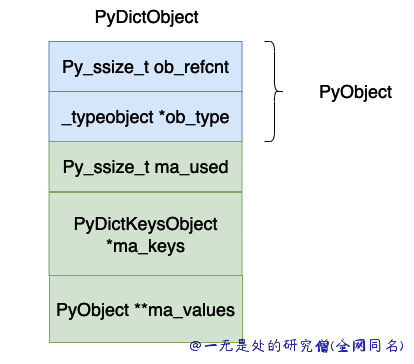
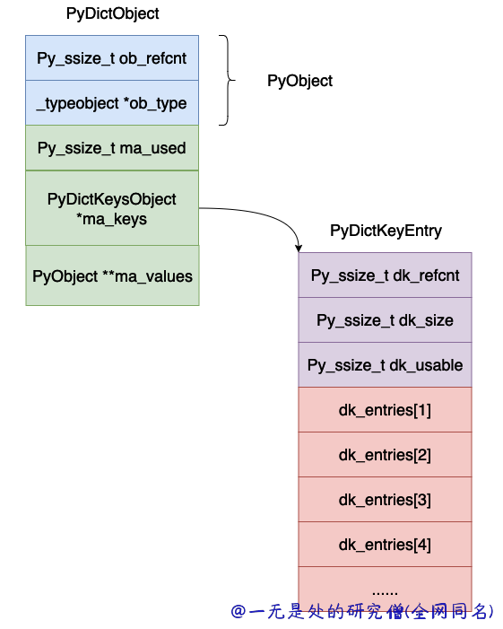

# 深入理解 Python 虚拟机：字典（dict）的实现原理及源码剖析

在本篇文章当中主要给大家深入介绍一下在 cpython 当中字典的实现原理，在本篇文章当中主要介绍在早期 python3 当中的版本字典的实现，现在的字典做了部分优化，我们在后面的文章当中再介绍。

## 字典数据结构分析

```c
/* The ma_values pointer is NULL for a combined table
 * or points to an array of PyObject* for a split table
 */
typedef struct {
    PyObject_HEAD
    Py_ssize_t ma_used;
    PyDictKeysObject *ma_keys;
    PyObject **ma_values;
} PyDictObject;

struct _dictkeysobject {
    Py_ssize_t dk_refcnt;
    Py_ssize_t dk_size;
    dict_lookup_func dk_lookup;
    Py_ssize_t dk_usable;
    PyDictKeyEntry dk_entries[1];
};

typedef struct {
    /* Cached hash code of me_key. */
    Py_hash_t me_hash;
    PyObject *me_key;
    PyObject *me_value; /* This field is only meaningful for combined tables */
} PyDictKeyEntry;
```



上面的各个字段的含义为：

- ob_refcnt，对象的引用计数。
- ob_type，对象的数据类型。
- ma_used，当前哈希表当中的数据个数。
- ma_keys，指向保存键值对的数组。
- ma_values，这个指向值的数组，但是在 cpython 的具体实现当中不一定使用这个值，因为 _dictkeysobject 当中的 PyDictKeyEntry 数组当中的对象也是可以存储 value 的，这个值只有在键全部是字符串的时候才可能会使用，在本篇文章当中主要使用 PyDictKeyEntry 当中的 value 来讨论字典的实现，因此大家可以忽略这个变量。
- dk_refcnt，这个也是用于表示引用计数，这个跟字典的视图有关系，原理和引用计数类似，这里暂时不管。
- dk_size，这个表示哈希表的大小，必须是 $2^n$，这样的话可以将模运算变成位与运算。
- dk_lookup，这个表示哈希表的查找函数，他是一个函数指针。
- dk_usable，表示当前数组当中还有多少个可以使用的键值对。
- dk_entries，哈希表，真正存储键值对的地方。

整个哈希表的布局大致如下图所示：




## 创建新字典对象

这个函数还是比较简单，首先申请内存空间，然后进行一些初始化操作，申请哈希表用于保存键值对。

```c
static PyObject *
dict_new(PyTypeObject *type, PyObject *args, PyObject *kwds)
{
    PyObject *self;
    PyDictObject *d;

    assert(type != NULL && type->tp_alloc != NULL);
    // 申请内存空间
    self = type->tp_alloc(type, 0);
    if (self == NULL)
        return NULL;
    d = (PyDictObject *)self;

    /* The object has been implicitly tracked by tp_alloc */
    if (type == &PyDict_Type)
        _PyObject_GC_UNTRACK(d);
    // 因为还没有增加数据 因此哈希表当中 ma_used = 0
    d->ma_used = 0;
    // 申请保存键值对的数组  PyDict_MINSIZE_COMBINED 是一个宏定义 值为 8 表示哈希表数组的最小长度
    d->ma_keys = new_keys_object(PyDict_MINSIZE_COMBINED);
    // 如果申请失败返回 NULL
    if (d->ma_keys == NULL) {
        Py_DECREF(self);
        return NULL;
    }
    return self;
}

// new_keys_object 函数如下所示
static PyDictKeysObject *new_keys_object(Py_ssize_t size)
{
    PyDictKeysObject *dk;
    Py_ssize_t i;
    PyDictKeyEntry *ep0;

    assert(size >= PyDict_MINSIZE_SPLIT);
    assert(IS_POWER_OF_2(size));
    // 这里是申请内存的位置真正申请内存空间的大小为 PyDictKeysObject 的大小加上 size-1 个PyDictKeyEntry的大小
    // 这里你可能会有一位为啥不是 size 个 PyDictKeyEntry 的大小 因为在结构体 PyDictKeysObject 当中已经申请了一个 PyDictKeyEntry 对象了
    dk = PyMem_MALLOC(sizeof(PyDictKeysObject) +
                      sizeof(PyDictKeyEntry) * (size-1));
    if (dk == NULL) {
        PyErr_NoMemory();
        return NULL;
    }
    // 下面主要是一些初始化的操作 dk_refcnt 设置成 1 因为目前只有一个字典对象使用 这个 PyDictKeysObject 对象
    DK_DEBUG_INCREF dk->dk_refcnt = 1;
    dk->dk_size = size; // 哈希表的大小
    // 下面这行代码主要是表示哈希表当中目前还能存储多少个键值对 在 cpython 的实现当中允许有 2/3 的数组空间去存储数据 超过这个数则需要进行扩容
    dk->dk_usable = USABLE_FRACTION(size); // #define USABLE_FRACTION(n) ((((n) << 1)+1)/3)
    ep0 = &dk->dk_entries[0];
    /* Hash value of slot 0 is used by popitem, so it must be initialized */
    ep0->me_hash = 0;
    // 将所有的键值对初始化成 NULL
    for (i = 0; i < size; i++) {
        ep0[i].me_key = NULL;
        ep0[i].me_value = NULL;
    }
    dk->dk_lookup = lookdict_unicode_nodummy;
    return dk;
}
```


## 哈希表扩容机制

首先我们先了解一下字典实现当中哈希表的扩容机制，当我们不断的往字典当中加入新的数据的时候，很快字典当中的数据就会达到数组长度的 $\frac{2}{3}$ ，这个时候就需要扩容，扩容之后的数组大小计算方式如下：

```c
#define GROWTH_RATE(d) (((d)->ma_used*2)+((d)->ma_keys->dk_size>>1))
```

新的数组的大小等于原来键值对的个数乘以 2 加上原来数组长度的一半。

总的来说扩容主要有三个步骤：

- 计算新的数组的大小。

- 创建新的数组。
- 将原来的哈希表当中的数据加入到新的数组当中（也就是再哈希的过程）。

具体的实现代码如下所示：

```c
static int
insertion_resize(PyDictObject *mp)
{
    return dictresize(mp, GROWTH_RATE(mp));
}

static int
dictresize(PyDictObject *mp, Py_ssize_t minused)
{
    Py_ssize_t newsize;
    PyDictKeysObject *oldkeys;
    PyObject **oldvalues;
    Py_ssize_t i, oldsize;
    // 下面的代码的主要作用就是计算得到能够大于等于 minused 最小的 2 的整数次幂
/* Find the smallest table size > minused. */
    for (newsize = PyDict_MINSIZE_COMBINED;
         newsize <= minused && newsize > 0;
         newsize <<= 1)
        ;
    if (newsize <= 0) {
        PyErr_NoMemory();
        return -1;
    }
    oldkeys = mp->ma_keys;
    oldvalues = mp->ma_values;
    /* Allocate a new table. */
   // 创建新的数组
    mp->ma_keys = new_keys_object(newsize);
    if (mp->ma_keys == NULL) {
        mp->ma_keys = oldkeys;
        return -1;
    }
    if (oldkeys->dk_lookup == lookdict)
        mp->ma_keys->dk_lookup = lookdict;
    oldsize = DK_SIZE(oldkeys);
    mp->ma_values = NULL;
    /* If empty then nothing to copy so just return */
    if (oldsize == 1) {
        assert(oldkeys == Py_EMPTY_KEYS);
        DK_DECREF(oldkeys);
        return 0;
    }
    /* Main loop below assumes we can transfer refcount to new keys
     * and that value is stored in me_value.
     * Increment ref-counts and copy values here to compensate
     * This (resizing a split table) should be relatively rare */
    if (oldvalues != NULL) {
        for (i = 0; i < oldsize; i++) {
            if (oldvalues[i] != NULL) {
                Py_INCREF(oldkeys->dk_entries[i].me_key);
                oldkeys->dk_entries[i].me_value = oldvalues[i];
            }
        }
    }
    /* Main loop */
    // 将原来数组当中的元素加入到新的数组当中
    for (i = 0; i < oldsize; i++) {
        PyDictKeyEntry *ep = &oldkeys->dk_entries[i];
        if (ep->me_value != NULL) {
            assert(ep->me_key != dummy);
            insertdict_clean(mp, ep->me_key, ep->me_hash, ep->me_value);
        }
    }
    // 更新一下当前哈希表当中能够插入多少数据
    mp->ma_keys->dk_usable -= mp->ma_used;
    if (oldvalues != NULL) {
        /* NULL out me_value slot in oldkeys, in case it was shared */
        for (i = 0; i < oldsize; i++)
            oldkeys->dk_entries[i].me_value = NULL;
        assert(oldvalues != empty_values);
        free_values(oldvalues);
        DK_DECREF(oldkeys);
    }
    else {
        assert(oldkeys->dk_lookup != lookdict_split);
        if (oldkeys->dk_lookup != lookdict_unicode_nodummy) {
            PyDictKeyEntry *ep0 = &oldkeys->dk_entries[0];
            for (i = 0; i < oldsize; i++) {
                if (ep0[i].me_key == dummy)
                    Py_DECREF(dummy);
            }
        }
        assert(oldkeys->dk_refcnt == 1);
        DK_DEBUG_DECREF PyMem_FREE(oldkeys);
    }
    return 0;
}
```

## 字典插入数据

我们在不断的往字典当中插入数据的时候很可能会遇到哈希冲突，字典处理哈希冲突的方法基本和集合遇到哈希冲突的处理方法是差不多的，都是使用开发地址法，但是这个开放地址法实现的相对比较复杂，具体程序如下所示：

```c
static void
insertdict_clean(PyDictObject *mp, PyObject *key, Py_hash_t hash,
                 PyObject *value)
{
    size_t i;
    size_t perturb;
    PyDictKeysObject *k = mp->ma_keys;
    // 首先得到 mask 的值
    size_t mask = (size_t)DK_SIZE(k)-1;
    PyDictKeyEntry *ep0 = &k->dk_entries[0];
    PyDictKeyEntry *ep;
  
    i = hash & mask;
    ep = &ep0[i];
    for (perturb = hash; ep->me_key != NULL; perturb >>= PERTURB_SHIFT) {
        // 下面便是遇到哈希冲突时的处理办法
        i = (i << 2) + i + perturb + 1;
        ep = &ep0[i & mask];
    }
    assert(ep->me_value == NULL);
    ep->me_key = key;
    ep->me_hash = hash;
    ep->me_value = value;
}
```

## 总结

在本篇文章当中主要给大家简单介绍了一下在 cpython 内部字典的实现机制，总的来说整个字典的实现机制还是相当复杂的，本篇文章只是谈到了整个字典实现的一小部分，主要设计字典的内存布局以及相关的数据结构，最重要的字典的创建扩容和插入，这对我们理解哈希表的结构还是非常有帮助的！！！

---

本篇文章是深入理解 python 虚拟机系列文章之一，文章地址：https://github.com/Chang-LeHung/dive-into-cpython

更多精彩内容合集可访问项目：<https://github.com/Chang-LeHung/CSCore>

关注公众号：一无是处的研究僧，了解更多计算机（Java、Python、计算机系统基础、算法与数据结构）知识。

