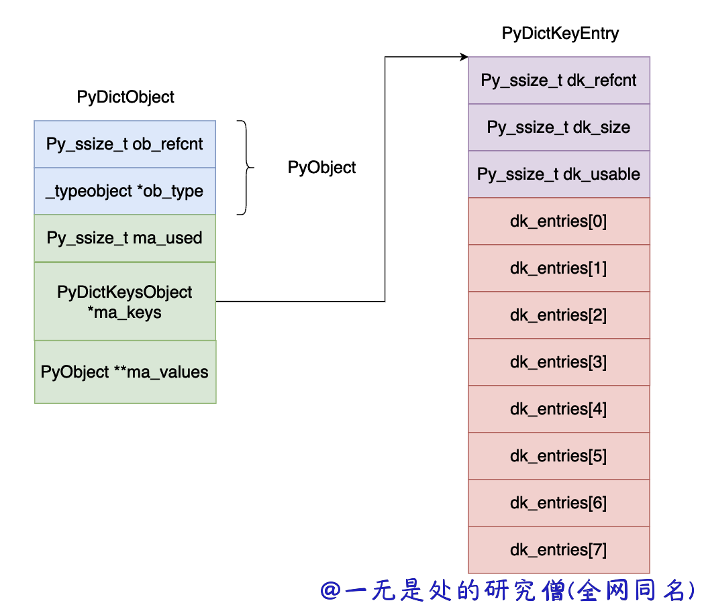
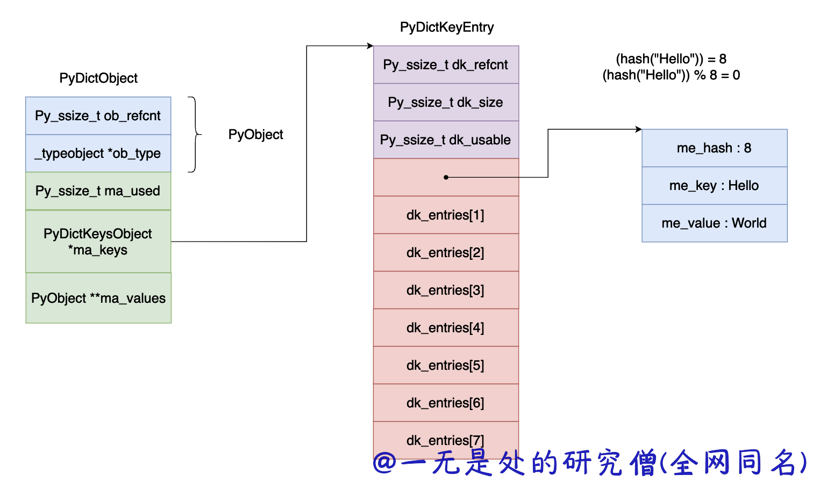
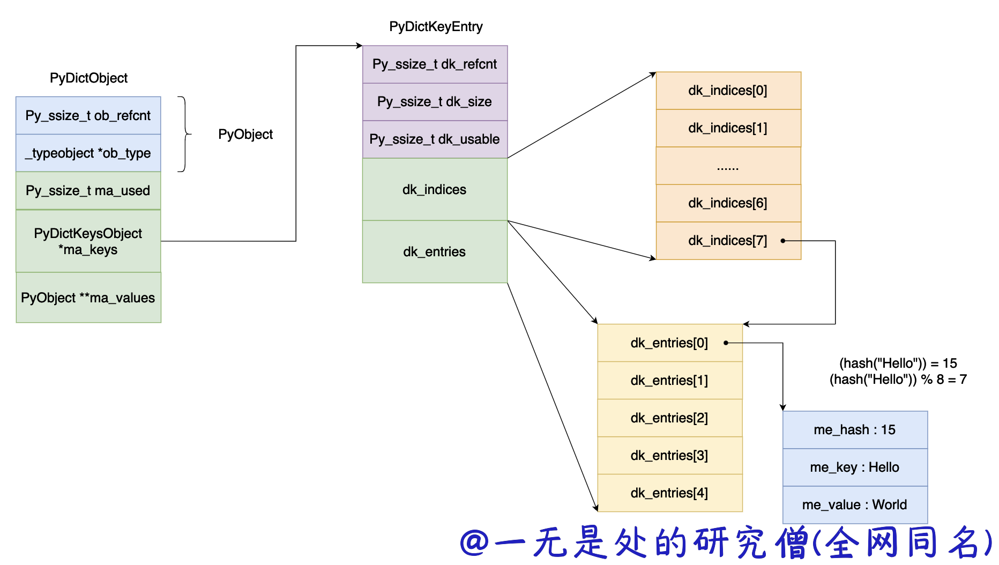
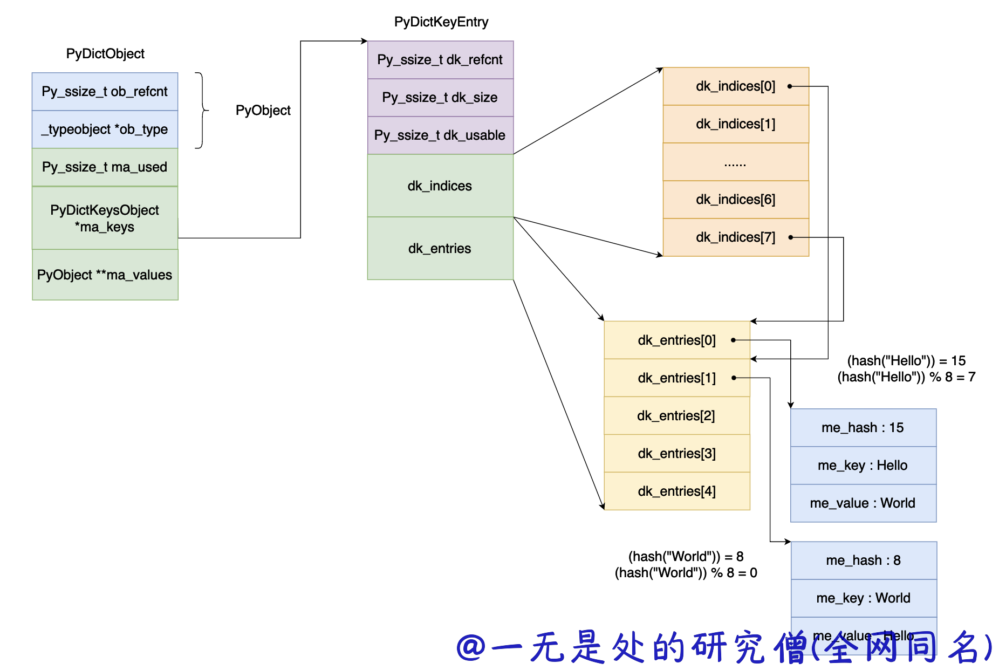

# 深入理解 Python 虚拟机：字典（dict）的优化

在前面的文章当中我们讨论的是 python3 当中早期的内嵌数据结构字典的实现，在本篇文章当中主要介绍在后续对于字典的内存优化。

## 字典优化

在前面的文章当中我们介绍的字典的数据结构主要如下所示：

```c

typedef struct {
    PyObject_HEAD
    Py_ssize_t ma_used;
    PyDictKeysObject *ma_keys;
    PyObject **ma_values;
} PyDictObject;

struct _dictkeysobject {
    Py_ssize_t dk_refcnt;
    Py_ssize_t dk_size;
    dict_lookup_func dk_lookup;
    Py_ssize_t dk_usable;
    PyDictKeyEntry dk_entries[1];
};

typedef struct {
    /* Cached hash code of me_key. */
    Py_hash_t me_hash;
    PyObject *me_key;
    PyObject *me_value; /* This field is only meaningful for combined tables */
} PyDictKeyEntry;
```

用图示的方式表示如下图所示：



所有的键值对都存储在 dk_entries 数组当中，比如对于 "Hello" "World" 这个键值对存储过程如下所示，如果 "Hello" 的哈希值等于 8 ，那么计算出来对象在 dk_entries 数组当中的下标位 0 。



在前面的文章当中我们谈到了，在 cpython 当中 dk_entries 数组当中的一个对象占用 24 字节的内存空间，在 cpython 当中的负载因子是 $\frac{2}{3}$ 。而一个 entry 的大小是 24 个字节，如果 dk_entries 的长度是 1024 的话，那么大概有 1024  / 3 * 24 = 8K 的内存空间是浪费的。为了解决这个问题，在新版的 cpython 当中采取了一个策略用于减少内存的使用。具体的设计如下图所示：



在新的字典当中 cpython 对于 dk_entries 来说如果正常的哈希表的长度为 8 的话，因为负载因子是 $\frac{2}{3}$ 真正给 dk_entries 分配的长度是 5 = 8 / 3，那么现在有一个问题就是如何根据不同的哈希值进行对象的存储。dk_indices 就是这个作用的，他的长度和真正的哈希表的长度是一样的，dk_indices 是一个整型数组这个数组保存的是要保存对象在 dk_entries 当中的下标，比如在上面的例子当中 dk_indices[7] = 0，就表示哈希值求余数之后的值等于 7，0 表示对象在 dk_entries 当中的下标。

现在我们再插入一个数据 "World" "Hello" 键值对，假设 "World" 的哈希值等于 8，那么对哈希值求余数之后等于 0 ，那么 dk_indices[0] 就是保存对象在 dk_entries 数组当中的下标的，图中对应的下标为 1 （因为 dk_entries 数组当中的每个数据都要使用，因此直接递增即可，下一个对象来的话就保存在 dk_entries 数组的第 3 个（下标为 2）位置）。




## 内存分析

首先我们先来分析一下数组 dk_indices 的数据类型，在 cpython 的内部实现当中并没有一刀切的直接将这个数组当中的数据类型设置成 int 类型。

dk_indices 数组主要有以下几个类型：

- 当哈希表长度小于 0xff 时，dk_indices 的数据类型为 int8_t ，即一个元素值占一个字节。
- 当哈希表长度小于 0xffff 时，dk_indices 的数据类型为 int16_t ，即一个元素值占 2 一个字节。
- 当哈希表长度小于 0xffffffff 时，dk_indices 的数据类型为 int32_t ，即一个元素值占 4 个字节。
- 当哈希表长度大于 0xffffffff 时，dk_indices 的数据类型为 int64_t ，即一个元素值占 8 个字节。

与这个相关的代码如下所示：

```c
/* lookup indices.  returns DKIX_EMPTY, DKIX_DUMMY, or ix >=0 */
static inline Py_ssize_t
dictkeys_get_index(const PyDictKeysObject *keys, Py_ssize_t i)
{
    Py_ssize_t s = DK_SIZE(keys);
    Py_ssize_t ix;

    if (s <= 0xff) {
        const int8_t *indices = (const int8_t*)(keys->dk_indices);
        ix = indices[i];
    }
    else if (s <= 0xffff) {
        const int16_t *indices = (const int16_t*)(keys->dk_indices);
        ix = indices[i];
    }
#if SIZEOF_VOID_P > 4
    else if (s > 0xffffffff) {
        const int64_t *indices = (const int64_t*)(keys->dk_indices);
        ix = indices[i];
    }
#endif
    else {
        const int32_t *indices = (const int32_t*)(keys->dk_indices);
        ix = indices[i];
    }
    assert(ix >= DKIX_DUMMY);
    return ix;
}
```

现在来分析一下相关的内存使用情况：

| **哈希表长度** | 能够保存的键值对数目  | **老版本**           | **新版本**                       | **节约内存量（字节）** |
| :------------- | :-------------------- | :------------------- | :------------------------------- | :--------------------- |
| 256            | 256 * 2 / 3 = 170     | 24 * 256 = 6144      | 1 * 256 + 24 * 170 = 4336        | 1808                   |
| 65536          | 65536 * 2 / 3 = 43690 | 24 * 65536 = 1572864 | 2 * 65536 + 24 * 43690 = 1179632 | 393232                 |

从上面的表格我们可以看到哈希表的长度越大我们节约的内存就越大，优化的效果就越明显。

## 总结

在本篇文章当中主要介绍了在 python3 当中对于字典的优化操作，主要是通过一个内存占用量比较小的数组去保存键值对在真实保存键值对当中的下标实现的，这个方法对于节约内存的效果是非常明显的。

---

本篇文章是深入理解 python 虚拟机系列文章之一，文章地址：https://github.com/Chang-LeHung/dive-into-cpython

更多精彩内容合集可访问项目：<https://github.com/Chang-LeHung/CSCore>

关注公众号：一无是处的研究僧，了解更多计算机（Java、Python、计算机系统基础、算法与数据结构）知识。

