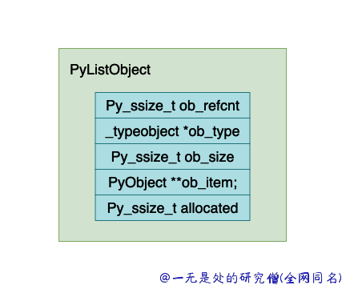
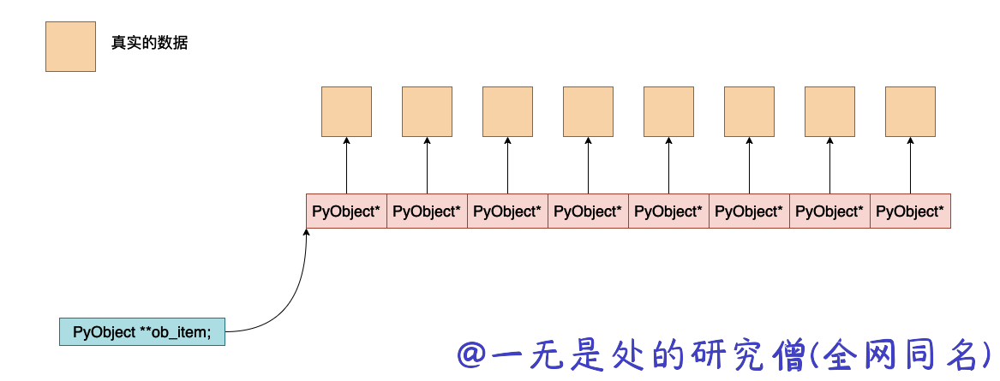

# 深入理解 Python 虚拟机：列表（list）的实现原理及源码剖析

在本篇文章当中主要给大家介绍 cpython 虚拟机当中针对列表的实现，在 Python 中，List 是一种非常常用的数据类型，可以存储任何类型的数据，并且支持各种操作，如添加、删除、查找、切片等，在本篇文章当中将深入去分析这一点是如何实现的。

## 列表的结构

在 cpython 实现的 python 虚拟机当中，下面就是 cpython 内部列表实现的源代码：

```c
typedef struct {
    PyObject_VAR_HEAD
    /* Vector of pointers to list elements.  list[0] is ob_item[0], etc. */
    PyObject **ob_item;

    /* ob_item contains space for 'allocated' elements.  The number
     * currently in use is ob_size.
     * Invariants:
     *     0 <= ob_size <= allocated
     *     len(list) == ob_size
     *     ob_item == NULL implies ob_size == allocated == 0
     * list.sort() temporarily sets allocated to -1 to detect mutations.
     *
     * Items must normally not be NULL, except during construction when
     * the list is not yet visible outside the function that builds it.
     */
    Py_ssize_t allocated;
} PyListObject;

#define PyObject_VAR_HEAD      PyVarObject ob_base;
typedef struct {
    PyObject ob_base;
    Py_ssize_t ob_size; /* Number of items in variable part */
} PyVarObject;

typedef struct _object {
    _PyObject_HEAD_EXTRA // 这个宏定义为空
    Py_ssize_t ob_refcnt;
    struct _typeobject *ob_type;
} PyObject;

```

将上面的结构体展开之后，PyListObject 的结构大致如下所示：



现在来解释一下上面的各个字段的含义：

- ob_refcnt，表示对象的引用记数的个数，这个对于垃圾回收很有用处，后面我们分析虚拟机中垃圾回收部分在深入分析。
- ob_type，表示这个对象的数据类型是什么，在 python 当中有时候需要对数据的数据类型进行判断比如 isinstance, type 这两个关键字就会使用到这个字段。
- ob_size，这个字段表示这个列表当中有多少个元素。
- ob_item，这是一个指针，指向真正保存 python 对象数据的地址，大致的内存他们之间大致的内存布局如下所示：



- allocated，这个表示在进行内存分配的时候，一共分配了多少个 (PyObject *) ，真实分配的内存空间为 `allocated * sizeof(PyObject *)`。

## 列表操作函数源代码分析

### 创建链表

首先需要了解的是在 python 虚拟机内部为列表创建了一个数组，所有的创建的被释放的内存空间，并不会直接进行释放而是会将这些内存空间的首地址保存到这个数组当中，好让下一次申请创建新的列表的时候不需要再申请内存空间，而是直接将之前需要释放的内存直接进行复用即可。

```c
/* Empty list reuse scheme to save calls to malloc and free */
#ifndef PyList_MAXFREELIST
#define PyList_MAXFREELIST 80
#endif
static PyListObject *free_list[PyList_MAXFREELIST];
static int numfree = 0;
```


```c
PyObject *
PyList_New(Py_ssize_t size)
{
    PyListObject *op;
    size_t nbytes;

    if (size < 0) {
        PyErr_BadInternalCall();
        return NULL;
    }
    /* Check for overflow without an actual overflow,
     *  which can cause compiler to optimise out */
    if ((size_t)size > PY_SIZE_MAX / sizeof(PyObject *))
        return PyErr_NoMemory();
    nbytes = size * sizeof(PyObject *);
    if (numfree) {
        numfree--;
        op = free_list[numfree];
        _Py_NewReference((PyObject *)op);
    } else {
        op = PyObject_GC_New(PyListObject, &PyList_Type);
        if (op == NULL)
            return NULL;
    }
    if (size <= 0)
        op->ob_item = NULL;
    else {
        op->ob_item = (PyObject **) PyMem_MALLOC(nbytes);
        if (op->ob_item == NULL) {
            Py_DECREF(op);
            return PyErr_NoMemory();
        }
        memset(op->ob_item, 0, nbytes);
    }
    Py_SIZE(op) = size;
    op->allocated = size;
    _PyObject_GC_TRACK(op);
    return (PyObject *) op;
}
```

