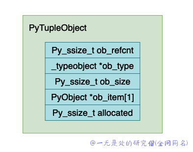
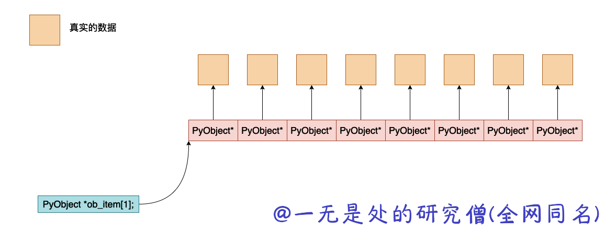
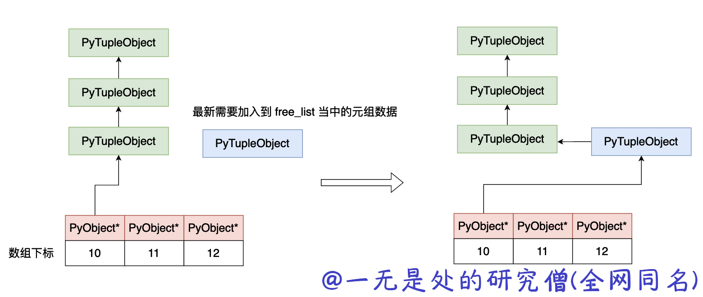

# 深入理解 Python 虚拟机：元组（tuple）的实现原理及源码剖析

在本篇文章当中主要给大家介绍 cpython 虚拟机当中针对列表的实现，在 Python 中，tuple 是一种非常常用的数据类型，在本篇文章当中将深入去分析这一点是如何实现的。

## 元组的结构

在这一小节当中主要介绍在 python 当中元组的数据结构：
```c
typedef struct {
    PyObject_VAR_HEAD
    PyObject *ob_item[1];

    /* ob_item contains space for 'ob_size' elements.
     * Items must normally not be NULL, except during construction when
     * the tuple is not yet visible outside the function that builds it.
     */
} PyTupleObject;

#define PyObject_VAR_HEAD      PyVarObject ob_base;
typedef struct {
    PyObject ob_base;
    Py_ssize_t ob_size; /* Number of items in variable part */
} PyVarObject;

typedef struct _object {
    _PyObject_HEAD_EXTRA
    Py_ssize_t ob_refcnt;
    struct _typeobject *ob_type;
} PyObject;
```

从上面的数据结构来看和 list 的数据结构基本上差不多，最终的使用方法也差不多。将上面的结构体展开之后，PyTupleObject 的结构大致如下所示：



现在来解释一下上面的各个字段的含义：

- Py_ssize_t，一个整型数据类型。

- ob_refcnt，表示对象的引用记数的个数，这个对于垃圾回收很有用处，后面我们分析虚拟机中垃圾回收部分在深入分析。
- ob_type，表示这个对象的数据类型是什么，在 python 当中有时候需要对数据的数据类型进行判断比如 isinstance, type 这两个关键字就会使用到这个字段。
- ob_size，这个字段表示这个元组当中有多少个元素。
- ob_item，这是一个指针，指向真正保存 python 对象数据的地址，大致的内存他们之间大致的内存布局如下所示：



需要注意的是元组的数组大小是不能够进行更改的，这一点和 list 不一样，我们可以注意到在 list 的数据结构当中还有一个 allocated 字段，但是在元组当中是没有的，这主要是因为元组的数组大小是固定的，而列表的数组大小是可以更改的。

## 元组操作函数源码剖析

### 创建元组

首先我们需要了解一下在 cpython 内部关于元组内存分配的问题，首先和 list 一样，在 cpython 当中对于分配的好的元组进行释放的时候，并不会直接进行释放，而是会先保存下来，当下次又有元组申请内存的时候，直接将这块内存进行返回即可。

在 cpython 内部会进行缓存的元组大小为 20，如果元组的长度为 0 - 19 那么在申请分配内存之后释放并不会直接释放，而是将其先保存下来，下次有需求的时候直接分配，而不需要申请。在 cpython 内部，相关的定义如下所示：

```c
static PyTupleObject *free_list[PyTuple_MAXSAVESIZE];
static int numfree[PyTuple_MAXSAVESIZE];
```

- free_list，保存指针——指向被释放的元组。
- numfree，对应的下标表示元组当中元素的个数，numfree[i] 表示有 i 个元素的元组的个数。

下面是新建 tuple 对象的源程序：

```c
PyObject *
PyTuple_New(Py_ssize_t size)
{
    PyTupleObject *op;
    Py_ssize_t i;
    if (size < 0) {
        PyErr_BadInternalCall();
        return NULL;
    }
#if PyTuple_MAXSAVESIZE > 0
    // 如果申请一个空的元组对象 当前的 free_list 当中是否存在空元组对象 如果存在则直接返回
    if (size == 0 && free_list[0]) k
        op = free_list[0];
        Py_INCREF(op);
        return (PyObject *) op;
    }
    // 如果元组的对象元素个数小于 20 而且对应的 free_list 当中还有余下的元组对象 则不需要进行内存申请直接返回
    if (size < PyTuple_MAXSAVESIZE && (op = free_list[size]) != NULL) {
        free_list[size] = (PyTupleObject *) op->ob_item[0];
        numfree[size]--;
        /* Inline PyObject_InitVar */
        _Py_NewReference((PyObject *)op); // _Py_NewReference 这个宏是将对象 op 的引用计数设置成 1
    }
    else
#endif
    {
        /* Check for overflow */
        // 如果元组的元素个数大或者等于 20 或者 当前 free_list 当中没有没有剩余的对象则需要进行内存申请
        if ((size_t)size > ((size_t)PY_SSIZE_T_MAX - sizeof(PyTupleObject) -
                    sizeof(PyObject *)) / sizeof(PyObject *)) {
          	// 如果元组长度大于某个值直接报内存错误
            return PyErr_NoMemory();
        }
        // 申请元组大小的内存空间
        op = PyObject_GC_NewVar(PyTupleObject, &PyTuple_Type, size);
        if (op == NULL)
            return NULL;
    }
		// 初始化内存空间
    for (i=0; i < size; i++)
        op->ob_item[i] = NULL;
#if PyTuple_MAXSAVESIZE > 0
    // 因为 size == 0 的元组不会进行修改操作 因此可以直接将这个申请到的对象放到 free_list 当中以备后续使用
    if (size == 0) {
        free_list[0] = op;
        ++numfree[0];
        Py_INCREF(op);          /* extra INCREF so that this is never freed */
    }
#endif
    _PyObject_GC_TRACK(op); // _PyObject_GC_TRACK 这个宏是将对象 op 将入到垃圾回收队列当中
    return (PyObject *) op;
}
```

新建元组对象的流程如下所示：

- 查看 free_list 当中是否已经存在空闲的元组，如果有则直接进行返回。
- 如果没有，则进行内存分配，然后将申请的内存空间进行初始化操作。
- 如果 size == 0，则可以将新分配的元组对象放到 free_list 当中。

### 查看元组的长度

这个功能比较简单，直接只用 cpython 当中的宏 Py_SIZE 即可。他的宏定义为 \#define Py_SIZE(ob) (((PyVarObject*)(ob))->ob_size)。

```c
static Py_ssize_t
tuplelength(PyTupleObject *a)
{
    return Py_SIZE(a);
}
```

### 元组当中是否包含数据

这个其实和 list 一样，就是遍历元组当中的数据，然后进行比较即可。

```c
static int
tuplecontains(PyTupleObject *a, PyObject *el)
{
    Py_ssize_t i;
    int cmp;

    for (i = 0, cmp = 0 ; cmp == 0 && i < Py_SIZE(a); ++i)
        cmp = PyObject_RichCompareBool(el, PyTuple_GET_ITEM(a, i),
                                           Py_EQ);
    return cmp;
}
```

### 获取和设置元组中的数据

这两个方法也比较简单，首先检查数据类型是不是元组类型，然后判断是否越界，之后就返回数据，或者设置对应的数据。

这里在设置数据数据的时候需要注意一点的是，当设置新的数据的时候，原来的 python 对象引用计数需要减去一，同理如果设置没有成功的话传入的新的数据的引用计数也需要减去一。

```c
PyObject *
PyTuple_GetItem(PyObject *op, Py_ssize_t i)
{
    if (!PyTuple_Check(op)) {
        PyErr_BadInternalCall();
        return NULL;
    }
    if (i < 0 || i >= Py_SIZE(op)) {
        PyErr_SetString(PyExc_IndexError, "tuple index out of range");
        return NULL;
    }
    return ((PyTupleObject *)op) -> ob_item[i];
}

int
PyTuple_SetItem(PyObject *op, Py_ssize_t i, PyObject *newitem)
{
    PyObject *olditem;
    PyObject **p;
    if (!PyTuple_Check(op) || op->ob_refcnt != 1) {
        Py_XDECREF(newitem);
        PyErr_BadInternalCall();
        return -1;
    }
    if (i < 0 || i >= Py_SIZE(op)) {
        Py_XDECREF(newitem);
        PyErr_SetString(PyExc_IndexError,
                        "tuple assignment index out of range");
        return -1;
    }
    p = ((PyTupleObject *)op) -> ob_item + i;
    olditem = *p;
    *p = newitem;
    Py_XDECREF(olditem);
    return 0;
}
```

### 释放元组内存空间

当我们在进行垃圾回收的时候，判定一个对象的引用计数等于 0 的时候就需要释放这块内存空间（相当于析构函数），下面就是释放 tuple 内存空间的函数。

```c
static void
tupledealloc(PyTupleObject *op)
{
    Py_ssize_t i;
    Py_ssize_t len =  Py_SIZE(op);
    PyObject_GC_UnTrack(op); // PyObject_GC_UnTrack 将对象从垃圾回收队列当中移除
    Py_TRASHCAN_SAFE_BEGIN(op) 
    if (len > 0) {
        i = len;
        while (--i >= 0)
            // 将这个元组指向的对象的引用计数减去一
            Py_XDECREF(op->ob_item[i]);
#if PyTuple_MAXSAVESIZE > 0
        // 如果这个元组对象满足加入 free_list  的条件，则将这个元组对象加入到 free_list 当中
        if (len < PyTuple_MAXSAVESIZE &&
            numfree[len] < PyTuple_MAXFREELIST &&
            Py_TYPE(op) == &PyTuple_Type)
        {
            op->ob_item[0] = (PyObject *) free_list[len];
            numfree[len]++;
            free_list[len] = op;
            goto done; /* return */
        }
#endif
    }
    Py_TYPE(op)->tp_free((PyObject *)op);
done:
    Py_TRASHCAN_SAFE_END(op)
}
```

将元组的内存空间回收的时候，主要有以下几个步骤：

- 将元组对象从垃圾回收链表当中移除。
- 将元组指向的所有对象的引用计数减一。
- 判断元组是否满足保存到 free_list 当中的条件，如果满足就将他加入到 free_list 当中去，否则回收这块内存。加入到 free_list 当中整个元组当中 ob_item 指向变化如下所示


