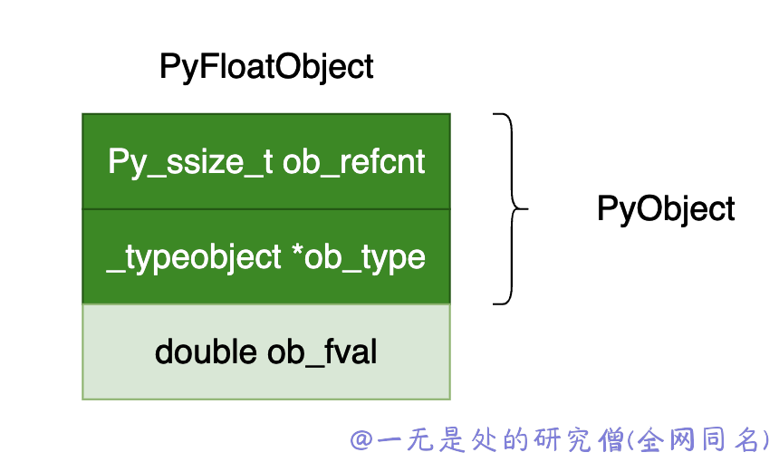
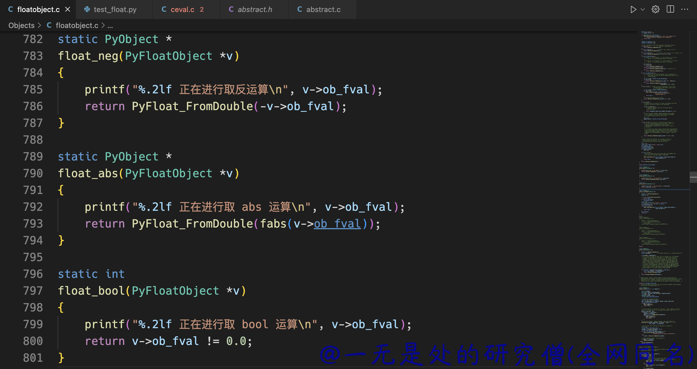
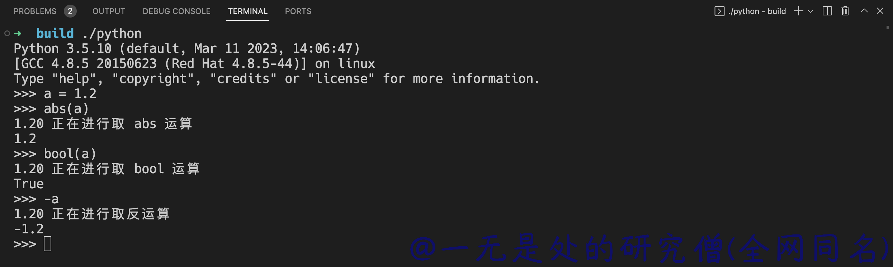

# 深入理解 Python 虚拟机：浮点数（float）的实现原理及源码剖析

在本篇文章当中主要分析在 cpython 虚拟机当中 float 类型的实现原理以及与他相关的一些源代码。

## Float 数据结构

在 cpython 虚拟机当中浮点数类型的数据结构定义如下所示：

```c
typedef struct {
    PyObject_HEAD
    double ob_fval;
} PyFloatObject;
```

上面的数据结构定义图示如下：



- 在上面的数据结构当中最重要的一个字段就是 ob_fval，这个就是真实存储浮点数的地方。
- ob_refcnt 就是对象的引用计数。
- ob_type 就是对象的类型。

## 浮点数的相关方法

### 创建 float 对象

和我们在前面所讨论到的元组和列表对象一样，在 cpython 内部实现 float 类型的时候也会给 float 对象做一层中间层以加快浮点数的内存分配，具体的相关代码如下所示：

```c
#define PyFloat_MAXFREELIST    100
static int numfree = 0;
static PyFloatObject *free_list = NULL;
```

在 cpython 内部做多会缓存 100 个 float 对象的内存空间，如果超过 100 就会直接释放内存了，这里需要注意一点的是只用一个指针就可以将所有的 float 对象缓存起来，这一点是如何实现的。

这是使用在对象 PyFloatObject 当中的 struct _typeobject *ob_type; 这个字段实现的，用这个字段指向下一个 float 对象的内存空间，因为在 free_list 当中的数据并没有使用，因此可以利用这个特点节省一些内存空间。下面则是创建 float 对象的具体过程：

```c
PyObject *
PyFloat_FromDouble(double fval)
{
    // 首先查看 free_list 当中是否有空闲的 float 对象
    PyFloatObject *op = free_list;
    if (op != NULL) {
        // 如果有 那么就将让 free_list 指向 free_list 当中的下一个 float 对象 并且将对应的个数减 1
        free_list = (PyFloatObject *) Py_TYPE(op);
        numfree--;
    } else {
      	// 否则的话就需要申请内存空间
        op = (PyFloatObject*) PyObject_MALLOC(sizeof(PyFloatObject));
        if (!op)
            return PyErr_NoMemory();
    }
    /* Inline PyObject_New */
    (void)PyObject_INIT(op, &PyFloat_Type); // PyObject_INIT 这个宏的主要作用是将对象的引用计数设置成 1
    op->ob_fval = fval;
    return (PyObject *) op;
}
```

### 加法

下面是在 cpython 当中浮点数的加法具体实现，整个过程比较简单就是得到新的值，并且创建一个新的 PyFloatObject 对象，并且将这个对象返回。

```c
static PyObject *
float_add(PyObject *v, PyObject *w)
{
    double a,b;
    CONVERT_TO_DOUBLE(v, a); // CONVERT_TO_DOUBLE 这个宏的主要作用就是将对象的 ob_fval 这个字段的值保存到 a 当中
    CONVERT_TO_DOUBLE(w, b); // 这个就是将 w 当中的 ob_fval 字段的值保存到 b 当中
    a = a + b;
    return PyFloat_FromDouble(a); // 创建一个新的 float 对象 并且将这个对象返回
}
```

### 减法

同理减法也是一样的。

```c
static PyObject *
float_sub(PyObject *v, PyObject *w)
{
    double a,b;
    CONVERT_TO_DOUBLE(v, a);
    CONVERT_TO_DOUBLE(w, b);
    a = a - b;
    return PyFloat_FromDouble(a);
}
```

### 乘法

```
static PyObject *
float_mul(PyObject *v, PyObject *w)
{
    double a,b;
    CONVERT_TO_DOUBLE(v, a);
    CONVERT_TO_DOUBLE(w, b);
    PyFPE_START_PROTECT("multiply", return 0)
    a = a * b;
    PyFPE_END_PROTECT(a)
    return PyFloat_FromDouble(a);
}
```

### 除法

```c
static PyObject *
float_div(PyObject *v, PyObject *w)
{
    double a,b;
    CONVERT_TO_DOUBLE(v, a);
    CONVERT_TO_DOUBLE(w, b);
    if (b == 0.0) {
        PyErr_SetString(PyExc_ZeroDivisionError,
                        "float division by zero");
        return NULL;
    }
    a = a / b;
    return PyFloat_FromDouble(a);
}
```

### 取反

这里加入了一行输出语句，这个是为了后面方便我们进行测试的。

```c
static PyObject *
float_neg(PyFloatObject *v)
{
    printf("%.2lf 正在进行取反运算\n", v->ob_fval);
    return PyFloat_FromDouble(-v->ob_fval);
}
```

### 求绝对值

```c
static PyObject *
float_abs(PyFloatObject *v)
{
    printf("%.2lf 正在进行取 abs 运算\n", v->ob_fval);
    return PyFloat_FromDouble(fabs(v->ob_fval));
}
```

### 求 bool 值

```c
static int
float_bool(PyFloatObject *v)
{
    printf("%.2lf 正在进行取 bool 运算\n", v->ob_fval);
    return v->ob_fval != 0.0;
}
```

下图是我们对于 cpython 对程序的修改！



下面是修改之后我们再次对浮点数进行操作的时候的输出，可以看到的是输出了我们在上面的代码当中加入的语句。



## 总结

在本篇文章当总主要介绍了一些 float 类型在 cpython 内部是如何实现的以及和他相关的加减乘除方法是如何实现的，以及和部分和关键字有关的函数实现。本篇文章主要是讨论 float 数据类型本身，不涉及其他的东西，其实关于类型还有非常大一块，就是 cpython 内部对象系统是如何实现的，这一点在后面深入讨论对象系统的时候再进行深入分析，在回头来看 float 类型会有更加深刻的理解。

---

本篇文章是深入理解 python 虚拟机系列文章之一，文章地址：https://github.com/Chang-LeHung/dive-into-cpython

更多精彩内容合集可访问项目：<https://github.com/Chang-LeHung/CSCore>

关注公众号：一无是处的研究僧，了解更多计算机（Java、Python、计算机系统基础、算法与数据结构）知识。

