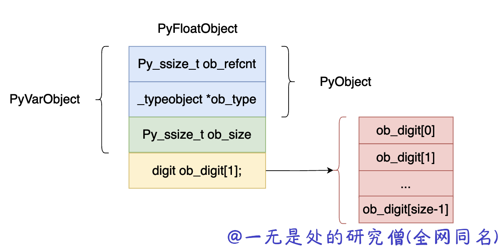
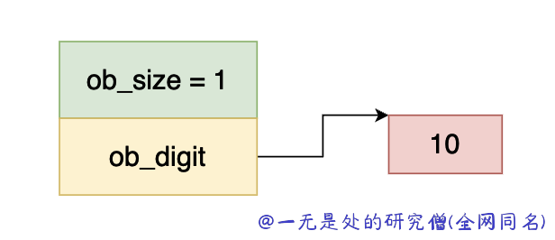
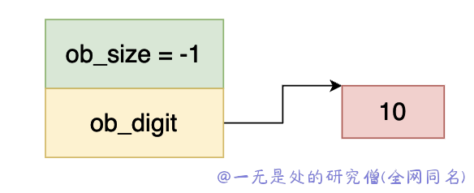
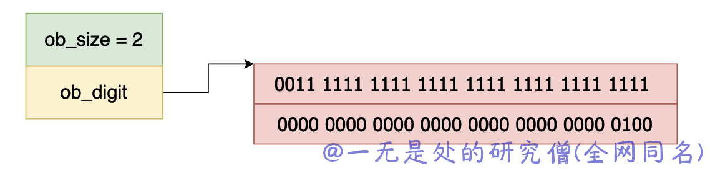
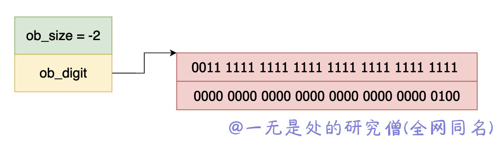

# 深入理解 Python 虚拟机：整型（int）的实现原理及源码剖析

在本篇文章当中主要给大家介绍在 cpython 内部是如何实现整型数据 int 的，主要是分析 int 类型的表示方式，分析 int 类型的巧妙设计。

## 数据结构

在 cpython 内部的 int 类型的实现数据结构如下所示：

```c
typedef struct _longobject PyLongObject;
struct _longobject {
	PyObject_VAR_HEAD
	digit ob_digit[1];
};
#define PyObject_VAR_HEAD      PyVarObject ob_base;
typedef struct {
    PyObject ob_base;
    Py_ssize_t ob_size; /* Number of items in variable part */
} PyVarObject;
typedef struct _object {
    _PyObject_HEAD_EXTRA
    Py_ssize_t ob_refcnt;
    struct _typeobject *ob_type;
} PyObject;
```

上面的数据结构用图的方式表示出来如下图所示：



- ob_refcnt，表示对象的引用记数的个数，这个对于垃圾回收很有用处，后面我们分析虚拟机中垃圾回收部分在深入分析。
- ob_type，表示这个对象的数据类型是什么，在 python 当中有时候需要对数据的数据类型进行判断比如 isinstance, type 这两个关键字就会使用到这个字段。
- ob_size，这个字段表示这个整型对象数组 ob_digit 当中一共有多少个元素。
- digit 类型其实就是 uint32_t 类型的一个 宏定义，表示 32 位的整型数据。

## 深入分析 PyLongObject 字段的语意

首先我们知道在 python 当中的整数是不会溢出的，这正是 PyLongObject 使用数组的原因。在 cpython 内部的实现当中，整数有 0 、正数、负数，对于这一点在 cpython 当中有以下几个规定：

- ob_size，保存的是数组的长度，ob_size 大于 0 时保存的是正数，当 ob_size 小于 0 时保存的是负数。
- ob_digit，保存的是整数的绝对值。在前面我们谈到了，ob_digit 是一个 32 位的数据，但是在 cpython 内部只会使用其中的前 30 位，这只为了避免溢出的问题。

我们下面使用几个例子来深入理解一下上面的规则：



在上图当中 ob_size  大于 0 ，说明这个数是一个正数，而 ob_digit 指向一个 int32 的数据，数的值等于 10，因此上面这个数表示整数 10 。



同理 ob_size 小于 0，而 ob_digit 等于 10，因此上图当中的数据表示 -10 。



上面是一个 ob_digit 数组长度为 2 的例子，上面所表示数据如下所示：
$$
1 \cdot2^0 + 1 \cdot2^1 + 1 \cdot2^2 + ... + 1 \cdot2^{29} + 0 \cdot2^{30} + 0 \cdot2^{31} + 1 \cdot2^{32}
$$


因为对于每一个数组元素来说我们只使用前 30 位，因此到第二个整型数据的时候正好对应着 $2^{30}$，大家可以对应着上面的结果了解整个计算过程。



上面也就很简单了：
$$
-(1 \cdot2^0 + 1 \cdot2^1 + 1 \cdot2^2 + ... + 1 \cdot2^{29} + 0 \cdot2^{30} + 0 \cdot2^{31} + 1 \cdot2^{32})
$$

## 小整数池


```c
PyObject *
PyLong_FromLong(long ival)
{
    PyLongObject *v;
    unsigned long abs_ival;
    unsigned long t;  /* unsigned so >> doesn't propagate sign bit */
    int ndigits = 0;
    int sign;

    CHECK_SMALL_INT(ival);

    if (ival < 0) {
        /* negate: can't write this as abs_ival = -ival since that
           invokes undefined behaviour when ival is LONG_MIN */
        abs_ival = 0U-(unsigned long)ival;
        sign = -1;
    }
    else {
        abs_ival = (unsigned long)ival;
        sign = ival == 0 ? 0 : 1;
    }

    /* Fast path for single-digit ints */
    if (!(abs_ival >> PyLong_SHIFT)) {
        v = _PyLong_New(1);
        if (v) {
            Py_SIZE(v) = sign;
            v->ob_digit[0] = Py_SAFE_DOWNCAST(
                abs_ival, unsigned long, digit);
        }
        return (PyObject*)v;
    }

    /* Larger numbers: loop to determine number of digits */
    t = abs_ival;
    while (t) {
        ++ndigits;
        t >>= PyLong_SHIFT;
    }
    v = _PyLong_New(ndigits);
    if (v != NULL) {
        digit *p = v->ob_digit;
        Py_SIZE(v) = ndigits*sign;
        t = abs_ival;
        while (t) {
            *p++ = Py_SAFE_DOWNCAST(
                t & PyLong_MASK, unsigned long, digit);
            t >>= PyLong_SHIFT;
        }
    }
    return (PyObject *)v;
}

```

```c
PyLongObject *
_PyLong_New(Py_ssize_t size)
{
    PyLongObject *result;
    /* Number of bytes needed is: offsetof(PyLongObject, ob_digit) +
       sizeof(digit)*size.  Previous incarnations of this code used
       sizeof(PyVarObject) instead of the offsetof, but this risks being
       incorrect in the presence of padding between the PyVarObject header
       and the digits. */
    if (size > (Py_ssize_t)MAX_LONG_DIGITS) {
        PyErr_SetString(PyExc_OverflowError,
                        "too many digits in integer");
        return NULL;
    }
    result = PyObject_MALLOC(offsetof(PyLongObject, ob_digit) +
                             size*sizeof(digit));
    if (!result) {
        PyErr_NoMemory();
        return NULL;
    }
    return (PyLongObject*)PyObject_INIT_VAR(result, &PyLong_Type, size);
}
```

