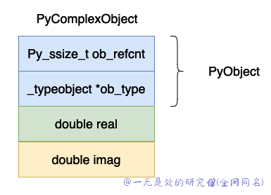
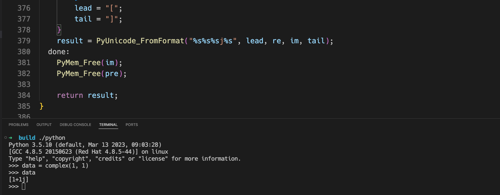

# 深入理解 Python 虚拟机：复数（complex）的实现原理及源码剖析

在本篇文章当中主要给大家介绍在 cpython 虚拟机当中是如何实现 复数 complex 这个数据类型的，这个数据类型在 cpython 当中一应该是一个算比较简单的数据类型了，非常容易理解。

## 复数数据结构

在 cpython 当中对于复数的数据结构实现如下所示：

```c
typedef struct {
    double real;
    double imag;
} Py_complex;
#define PyObject_HEAD                   PyObject ob_base;
typedef struct {
    PyObject_HEAD
    Py_complex cval;
} PyComplexObject;
typedef struct _object {
    _PyObject_HEAD_EXTRA
    Py_ssize_t ob_refcnt;
    struct _typeobject *ob_type;
} PyObject;
```

上面的数据结构图示如下：



复数的数据在整个 cpython 虚拟机当中来说应该算是比较简单的了，除了一个 PyObject 头部之外就是实部和虚部了。

- ob_refcnt，表示对象的引用记数的个数，这个对于垃圾回收很有用处，后面我们分析虚拟机中垃圾回收部分在深入分析。
- ob_type，表示这个对象的数据类型是什么，在 python 当中有时候需要对数据的数据类型进行判断比如 isinstance, type 这两个关键字就会使用到这个字段。

- real，表示复数的实部。
- imag，表示复数的虚部。

## 复数的操作

### 复数加法

下面是 cpython 当中对于复数加法的实现，为了简洁删除了部分无用代码。

```c
static PyObject *
complex_add(PyObject *v, PyObject *w)
{
    Py_complex result;
    Py_complex a, b;
    TO_COMPLEX(v, a); // TO_COMPLEX 这个宏的作用就是将一个 PyComplexObject 中的 Py_complex 对象存储到 a 当中
    TO_COMPLEX(w, b);
    result = _Py_c_sum(a, b); // 这个函数的具体实现在下方
    return PyComplex_FromCComplex(result); // 这个函数的具体实现在下方
}

// 真正实现复数加法的函数
Py_complex
_Py_c_sum(Py_complex a, Py_complex b)
{
    Py_complex r;
    r.real = a.real + b.real;
    r.imag = a.imag + b.imag;
    return r;
}

PyObject *
PyComplex_FromCComplex(Py_complex cval)
{
    PyComplexObject *op;

    /* Inline PyObject_New */
    // 申请内存空间
    op = (PyComplexObject *) PyObject_MALLOC(sizeof(PyComplexObject));
    if (op == NULL)
        return PyErr_NoMemory();
    // 将这个对象的引用计数设置成 1
    (void)PyObject_INIT(op, &PyComplex_Type);
    // 将复数结构体保存下来
    op->cval = cval;
    return (PyObject *) op;
}
```

上面代码的整体过程比较简单：

- 首先先从 PyComplexObject 提取真正的复数部分。
- 将提取到的两个复数进行相加操作。
- 根据得到的结果在创建一个 PyComplexObject 对象，并且将这个对象返回。

### 复数取反

复数取反操作就是将实部和虚部取相反数就可以了，这个操作也比较简单。

```c
static PyObject *
complex_neg(PyComplexObject *v)
{
    Py_complex neg;
    neg.real = -v->cval.real;
    neg.imag = -v->cval.imag;
    return PyComplex_FromCComplex(neg);
}

PyObject *
PyComplex_FromCComplex(Py_complex cval)
{
    PyComplexObject *op;

    /* Inline PyObject_New */
    op = (PyComplexObject *) PyObject_MALLOC(sizeof(PyComplexObject));
    if (op == NULL)
        return PyErr_NoMemory();
    (void)PyObject_INIT(op, &PyComplex_Type);
    op->cval = cval;
    return (PyObject *) op;
}
```

### Repr 函数

我们现在来介绍一下一个有趣的方法，就是复数类型的 repr 函数，这个和类的 \_\_repr\_\_ 函数是作用是一样的我们看一下复数的输出是什么：

```python
>>> data = complex(0, 1)
>>> data
1j
>>> data = complex(1, 1)
>>> data
(1+1j)
>>> print(data)
(1+1j)
```

复数的 repr 对应的 C 函数如下所示：

```c
static PyObject *
complex_repr(PyComplexObject *v)
{
    int precision = 0;
    char format_code = 'r';
    PyObject *result = NULL;

    /* If these are non-NULL, they'll need to be freed. */
    char *pre = NULL;
    char *im = NULL;

    /* These do not need to be freed. re is either an alias
       for pre or a pointer to a constant.  lead and tail
       are pointers to constants. */
    char *re = NULL;
    char *lead = "";
    char *tail = "";
    // 对应实部等于 0 虚部大于 0 的情况
    if (v->cval.real == 0. && copysign(1.0, v->cval.real)==1.0) {
        /* Real part is +0: just output the imaginary part and do not
           include parens. */
        re = "";
        im = PyOS_double_to_string(v->cval.imag, format_code,
                                   precision, 0, NULL);
        if (!im) {
            PyErr_NoMemory();
            goto done;
        }
    } else {
        /* Format imaginary part with sign, real part without. Include
           parens in the result. */
        // 将实部浮点数变成字符串
        pre = PyOS_double_to_string(v->cval.real, format_code,
                                    precision, 0, NULL);
        if (!pre) {
            PyErr_NoMemory();
            goto done;
        }
        re = pre;
        // 将虚部浮点数变成字符串
        im = PyOS_double_to_string(v->cval.imag, format_code,
                                   precision, Py_DTSF_SIGN, NULL);
        if (!im) {
            PyErr_NoMemory();
            goto done;
        }
        // 用什么括号包围起来
        lead = "(";
        tail = ")";
    }
    result = PyUnicode_FromFormat("%s%s%sj%s", lead, re, im, tail);
  done:
    PyMem_Free(im);
    PyMem_Free(pre);

    return result;
}
```

我们现在修改源程序将上面的 () 两个括号变成 []，编译之后执行的结果如下所示：



可以看到括号变成了 [] 。

## 总结

在本篇文章当中主要给大家介绍了在 cpython 虚拟机当中对于复数这一类型的数据结构以及他的具体实现。总体来说这个数据结构比较简单，操作也相对容易，比较容易理解，最后简单介绍了一下复数类型的 repr 实现，其实这个函数和 python 的类型系统有管，目前我们还没有仔细去讨论这一点，在后续的文章当中我们将深入的去学习这个知识点，现在我们就先了解其中部分函数即可。

---

本篇文章是深入理解 python 虚拟机系列文章之一，文章地址：https://github.com/Chang-LeHung/dive-into-cpython

更多精彩内容合集可访问项目：<https://github.com/Chang-LeHung/CSCore>

关注公众号：一无是处的研究僧，了解更多计算机（Java、Python、计算机系统基础、算法与数据结构）知识。

