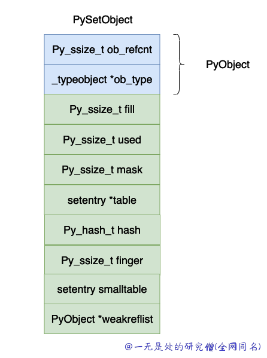

# 深入理解 Python 虚拟机：集合（set）的实现原理及源码剖析

在本篇文章当中主要给大家介绍在 cpython 虚拟机当中的集合 set 的实现原理以及对应的源代码分析。

## 数据结构介绍

```c
typedef struct {
    PyObject_HEAD

    Py_ssize_t fill;            /* Number active and dummy entries*/
    Py_ssize_t used;            /* Number active entries */

    /* The table contains mask + 1 slots, and that's a power of 2.
     * We store the mask instead of the size because the mask is more
     * frequently needed.
     */
    Py_ssize_t mask;

    /* The table points to a fixed-size smalltable for small tables
     * or to additional malloc'ed memory for bigger tables.
     * The table pointer is never NULL which saves us from repeated
     * runtime null-tests.
     */
    setentry *table;
    Py_hash_t hash;             /* Only used by frozenset objects */
    Py_ssize_t finger;          /* Search finger for pop() */

    setentry smalltable[PySet_MINSIZE]; // #define PySet_MINSIZE 8
    PyObject *weakreflist;      /* List of weak references */
} PySetObject;

typedef struct {
    PyObject *key;
    Py_hash_t hash;             /* Cached hash code of the key */
} setentry;

static PyObject _dummy_struct;

#define dummy (&_dummy_struct)
```

上面的数据结果用图示如下图所示：



上面各个字段的含义如下所示：

- dummy entries ：如果在哈希表当中的数组原来有一个数据，如果我们删除这个 entry 的时候，对应的位置就会被赋值成 dummy，与 dummy 有关的定义在上面的代码当中已经给出，dummy 对象的哈希值等于 -1。
- 明白 dummy 的含义之后，fill 和 used 这两个字段的含义就比较容易理解了，used 就是数组当中真实有效的对象的个数，fill 还需要加上 dummy 对象的个数。
- mask，数组的长度等于 $2^n$，mask 的值等于 $2^n - 1$ 。
- table，实际保存 entry 对象的数组。
- hash，这个值对 frozenset 有用，保存计算出来的哈希值。如果你的数组很大的话，计算哈希值其实也是一个比较大的开销，因此可以将计算出来的哈希值保存下来，以便下一次求的时候可以将哈希值直接返回，这也印证了在 python 当中为什么只有 immutable 对象才能够放入到集合和字典当中，因为哈希值计算一次保存下来了，如果再加入对象对象的哈希值也会变化，这样做就会发生错误了。
- finger，主要是用于记录下一个开始寻找被删除对象的下标，这个在数组很大的时候会加快寻找被删除对象。
- smalltable，默认的小数组，cpython 设置的一半的集合对象不会超过这个大小（8），因此在申请一个集合对象的时候直接就申请了这个小数组的内存大小。
- weakrelist，这个字段主要和垃圾回收有关，这里暂时不进行详细说明。

## 创建集合对象

首先先了解一下创建一个集合对象的过程，和前面其他的对象是一样的，首先先申请内存空间，然后进行相关的初始化操作。

这个函数有两个参数，使用第一个参数申请内存空间，然后后面一个参数如果不为 NULL 而且是一个可迭代对象的话，就将这里面的对象加入到集合当中。

```c
static PyObject *
make_new_set(PyTypeObject *type, PyObject *iterable)
{
    PySetObject *so = NULL;

    /* create PySetObject structure */
    so = (PySetObject *)type->tp_alloc(type, 0);
    if (so == NULL)
        return NULL;
    // 集合当中目前没有任何对象，因此 fill 和 used 都是 0
    so->fill = 0;
    so->used = 0;
    // 初始化哈希表当中的数组长度为 PySet_MINSIZE 因此 mask = PySet_MINSIZE - 1
    so->mask = PySet_MINSIZE - 1;
    // 让 table 指向存储 entry 的数组
    so->table = so->smalltable;
    // 将哈希值设置成 -1 表示还没有进行计算
    so->hash = -1;
    so->finger = 0;
    so->weakreflist = NULL;
    // 如果 iterable 不等于 NULL 则需要将它指向的对象当中所有的元素加入到集合当中
    if (iterable != NULL) {
        // 调用函数 set_update_internal 将对象 iterable 当中的元素加入到集合当中
        if (set_update_internal(so, iterable)) {
            Py_DECREF(so);
            return NULL;
        }
    }

    return (PyObject *)so;
}
```

## 往集合当中加入数据

首先我们先大致理清楚往集合当中插入数据的流程：

- 首先根据对象的哈希值，计算需要将对象放在哪个位置，也就是对应数组的下标。
- 查看对应下标的位置是否存在对象，如果不存在对象则将数据保存在对应下标的位置。
- 如果对应的位置存在对象，则查看是否和当前要插入的对象相等，则返回。
- 如果不想等，则使用类似于线性探测的方式去寻找下一个要插入的位置（具体的实现可以查看相关代码）。

```c
static PyObject *
set_add(PySetObject *so, PyObject *key)
{
    if (set_add_key(so, key))
        return NULL;
    Py_RETURN_NONE;
}

static int
set_add_key(PySetObject *so, PyObject *key)
{
    setentry entry;
    Py_hash_t hash;

    if (!PyUnicode_CheckExact(key) ||
        (hash = ((PyASCIIObject *) key)->hash) == -1) {
        hash = PyObject_Hash(key);
        if (hash == -1)
            return -1;
    }
    entry.key = key;
    entry.hash = hash;
    return set_add_entry(so, &entry);
}

static int
set_add_entry(PySetObject *so, setentry *entry)
{
    Py_ssize_t n_used;
    PyObject *key = entry->key;
    Py_hash_t hash = entry->hash;

    assert(so->fill <= so->mask);  /* at least one empty slot */
    n_used = so->used;
    Py_INCREF(key);
    if (set_insert_key(so, key, hash)) {
        Py_DECREF(key);
        return -1;
    }
    if (!(so->used > n_used && so->fill*3 >= (so->mask+1)*2))
        return 0;
    return set_table_resize(so, so->used>50000 ? so->used*2 : so->used*4);
}

static int
set_insert_key(PySetObject *so, PyObject *key, Py_hash_t hash)
{
    setentry *entry;

    entry = set_lookkey(so, key, hash);
    if (entry == NULL)
        return -1;
    if (entry->key == NULL) {
        /* UNUSED */
        entry->key = key;
        entry->hash = hash;
        so->fill++;
        so->used++;
    } else if (entry->key == dummy) {
        /* DUMMY */
        entry->key = key;
        entry->hash = hash;
        so->used++;
    } else {
        /* ACTIVE */
        Py_DECREF(key);
    }
    return 0;
}
```

