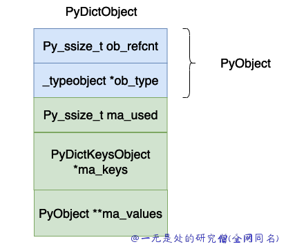
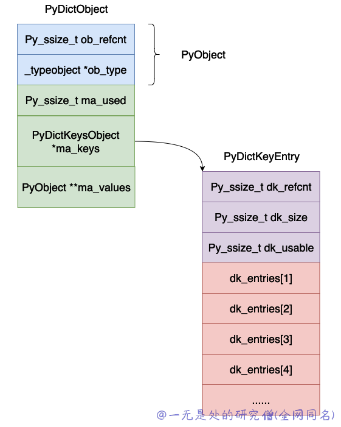

# 深入理解 Python 虚拟机：字典（dict）的实现原理及源码剖析

在本篇文章当中主要给大家深入介绍一下在 cpython 当中字典的实现原理，在本篇文章当中主要介绍在早期 python3 当中的版本字典的实现，现在的字典做了部分优化，我们在后面的文章当中再介绍。

## 字典数据结构分析

```c
/* The ma_values pointer is NULL for a combined table
 * or points to an array of PyObject* for a split table
 */
typedef struct {
    PyObject_HEAD
    Py_ssize_t ma_used;
    PyDictKeysObject *ma_keys;
    PyObject **ma_values;
} PyDictObject;

struct _dictkeysobject {
    Py_ssize_t dk_refcnt;
    Py_ssize_t dk_size;
    dict_lookup_func dk_lookup;
    Py_ssize_t dk_usable;
    PyDictKeyEntry dk_entries[1];
};

typedef struct {
    /* Cached hash code of me_key. */
    Py_hash_t me_hash;
    PyObject *me_key;
    PyObject *me_value; /* This field is only meaningful for combined tables */
} PyDictKeyEntry;
```



上面的各个字段的含义为：

- ob_refcnt，对象的引用计数。
- ob_type，对象的数据类型。
- ma_used，当前哈希表当中的数据个数。
- ma_keys，指向保存键值对的数组。
- ma_values，这个指向值的数组，但是在 cpython 的具体实现当中不一定使用这个值，因为 _dictkeysobject 当中的 PyDictKeyEntry 数组当中的对象也是可以存储 value 的，这个值只有在键全部是字符串的时候才可能会使用，在本篇文章当中主要使用 PyDictKeyEntry 当中的 value 来讨论字典的实现，因此大家可以忽略这个变量。
- dk_refcnt，这个也是用于表示引用计数，这个跟字典的视图有关系，原理和引用计数类似，这里暂时不管。
- dk_size，这个表示哈希表的大小，必须是 $2^n$，这样的话可以将模运算变成位与运算。
- dk_lookup，这个表示哈希表的查找函数，他是一个函数指针。
- dk_usable，表示当前数组当中还有多少个可以使用的键值对。
- dk_entries，哈希表，真正存储键值对的地方。

整个哈希表的布局大致如下图所示：




## 创建新字典对象

这个函数还是比较简单，首先申请内存空间，然后进行一些初始化操作，申请哈希表用于保存键值对。

```c
static PyObject *
dict_new(PyTypeObject *type, PyObject *args, PyObject *kwds)
{
    PyObject *self;
    PyDictObject *d;

    assert(type != NULL && type->tp_alloc != NULL);
    // 申请内存空间
    self = type->tp_alloc(type, 0);
    if (self == NULL)
        return NULL;
    d = (PyDictObject *)self;

    /* The object has been implicitly tracked by tp_alloc */
    if (type == &PyDict_Type)
        _PyObject_GC_UNTRACK(d);
    // 因为还没有增加数据 因此哈希表当中 ma_used = 0
    d->ma_used = 0;
    // 申请保存键值对的数组  PyDict_MINSIZE_COMBINED 是一个宏定义 值为 8 表示哈希表数组的最小长度
    d->ma_keys = new_keys_object(PyDict_MINSIZE_COMBINED);
    // 如果申请失败返回 NULL
    if (d->ma_keys == NULL) {
        Py_DECREF(self);
        return NULL;
    }
    return self;
}

// new_keys_object 函数如下所示
static PyDictKeysObject *new_keys_object(Py_ssize_t size)
{
    PyDictKeysObject *dk;
    Py_ssize_t i;
    PyDictKeyEntry *ep0;

    assert(size >= PyDict_MINSIZE_SPLIT);
    assert(IS_POWER_OF_2(size));
    // 这里是申请内存的位置真正申请内存空间的大小为 PyDictKeysObject 的大小加上 size-1 个PyDictKeyEntry的大小
    // 这里你可能会有一位为啥不是 size 个 PyDictKeyEntry 的大小 因为在结构体 PyDictKeysObject 当中已经申请了一个 PyDictKeyEntry 对象了
    dk = PyMem_MALLOC(sizeof(PyDictKeysObject) +
                      sizeof(PyDictKeyEntry) * (size-1));
    if (dk == NULL) {
        PyErr_NoMemory();
        return NULL;
    }
    // 下面主要是一些初始化的操作 dk_refcnt 设置成 1 因为目前只有一个字典对象使用 这个 PyDictKeysObject 对象
    DK_DEBUG_INCREF dk->dk_refcnt = 1;
    dk->dk_size = size; // 哈希表的大小
    // 下面这行代码主要是表示哈希表当中目前还能存储多少个键值对 在 cpython 的实现当中允许有 2/3 的数组空间去存储数据 超过这个数则需要进行扩容
    dk->dk_usable = USABLE_FRACTION(size); // #define USABLE_FRACTION(n) ((((n) << 1)+1)/3)
    ep0 = &dk->dk_entries[0];
    /* Hash value of slot 0 is used by popitem, so it must be initialized */
    ep0->me_hash = 0;
    // 将所有的键值对初始化成 NULL
    for (i = 0; i < size; i++) {
        ep0[i].me_key = NULL;
        ep0[i].me_value = NULL;
    }
    dk->dk_lookup = lookdict_unicode_nodummy;
    return dk;
}

```


