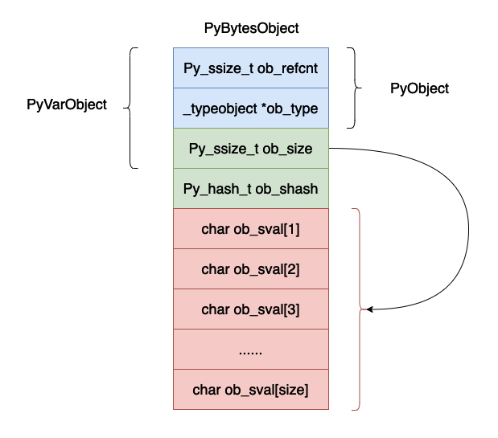
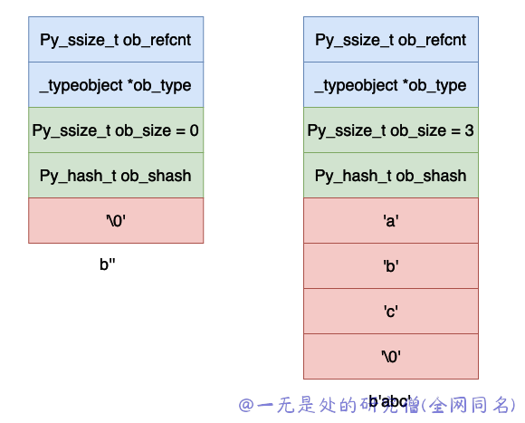

# 深入理解 Python 虚拟机：字节（bytes）的实现原理及源码剖析

在本篇文章当中主要给大家介绍在 cpython 内部，bytes 的实现原理。

## 数据结构

```c
typedef struct {
    PyObject_VAR_HEAD
    Py_hash_t ob_shash;
    char ob_sval[1];

    /* Invariants:
     *     ob_sval contains space for 'ob_size+1' elements.
     *     ob_sval[ob_size] == 0.
     *     ob_shash is the hash of the string or -1 if not computed yet.
     */
} PyBytesObject;

typedef struct {
    PyObject ob_base;
    Py_ssize_t ob_size; /* Number of items in variable part */
} PyVarObject;

typedef struct _object {
    Py_ssize_t ob_refcnt;
    struct _typeobject *ob_type;
} PyObject;
```

上面的数据结构用图示如下所示：



现在我们来解释一下上面的数据结构各个字段的含义：

- ob_refcnt，这个还是对象的引用计数的个数，主要是在垃圾回收的时候有用。
- ob_type，这个是对象的数据类型。
- ob_size，表示这个对象当中字节的个数。
- ob_shash，对象的哈希值，如果还没有计算，哈希值为 -1 。
- ob_sval，一个数据存储一个字节的数据，需要注意的是 ob_sval[size] 一定等于 '\0' ，表示字符串的结尾。

可能你会有疑问上面的结构体当中并没有后面的那么多字节啊，数组只有一个字节的数据啊，这是因为在 cpython 的实现当中除了申请 PyBytesObject 大的小内存空间之外，还会在这个基础之上申请连续的额外的内存空间用于保存数据，在后续的源码分析当中可以看到这一点。

下面我们举几个例子来说明一下上面的布局：



上面是空和字符串 abc 的字节表示。

## 创建字节对象

下面是在 cpython 当中通过字节数创建 PyBytesObject 对象的函数。下面的函数的主要功能是创建一个能够存储 size 个字节大小的数据的 PyBytesObject 对象，下面的函数最重要的一个步骤就是申请内存空间。

```c
static PyObject *
_PyBytes_FromSize(Py_ssize_t size, int use_calloc)
{
    PyBytesObject *op;
    assert(size >= 0);

    if (size == 0 && (op = nullstring) != NULL) {
#ifdef COUNT_ALLOCS
        null_strings++;
#endif
        Py_INCREF(op);
        return (PyObject *)op;
    }

    if ((size_t)size > (size_t)PY_SSIZE_T_MAX - PyBytesObject_SIZE) {
        PyErr_SetString(PyExc_OverflowError,
                        "byte string is too large");
        return NULL;
    }

    /* Inline PyObject_NewVar */
    // PyBytesObject_SIZE + size 就是实际申请的内存空间的大小 PyBytesObject_SIZE 就是表示 PyBytesObject 各个字段占用的实际的内存空间大小
    if (use_calloc)
        op = (PyBytesObject *)PyObject_Calloc(1, PyBytesObject_SIZE + size);
    else
        op = (PyBytesObject *)PyObject_Malloc(PyBytesObject_SIZE + size);
    if (op == NULL)
        return PyErr_NoMemory();
    // 将对象的 ob_size 字段赋值成 size 
    (void)PyObject_INIT_VAR(op, &PyBytes_Type, size);
    // 由于对象的哈希值还没有进行计算 因此现将哈希值赋值成 -1
    op->ob_shash = -1;
    if (!use_calloc)
        op->ob_sval[size] = '\0';
    /* empty byte string singleton */
    if (size == 0) {
        nullstring = op;
        Py_INCREF(op);
    }
    return (PyObject *) op;
}
```

我们可以使用一个写例子来看一下实际的 PyBytesObject 内存空间的大小。

```python
>>> import sys
>>> a = b"hello world"
>>> sys.getsizeof(a)
44
>>>
```

上面的 44 = 32 + 11 + 1 。

其中 32 是 PyBytesObject 4 个字段所占用的内存空间，ob_refcnt、ob_type、ob_size和 ob_shash 各占 8 个字节。11 是表示字符串 "hello world" 占用 11 个字节，最后一个字节是 '\0' 。

