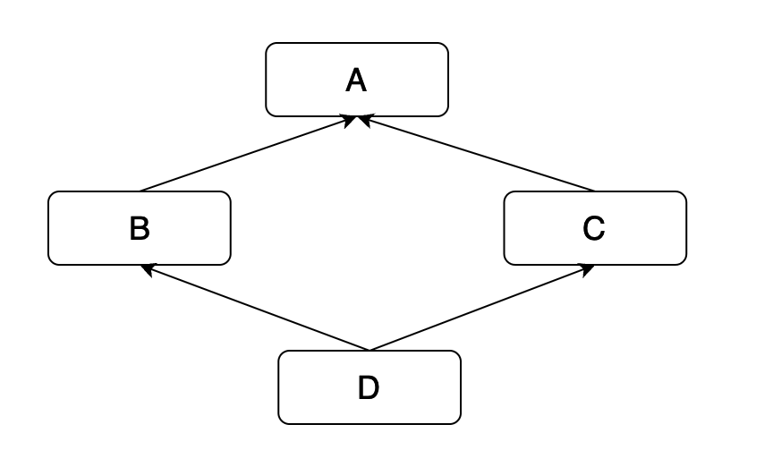

# 深入理解 python 虚拟机：多继承与 mro

在本篇文章当中将主要给大家介绍 python 当中的多继承和 mro，通过介绍在多继承当中存在的问题就能够理解在 cpython 当中引入 c3 算法的原因了，从而能够帮助大家更好的了理解 mro 。

## python 继承的问题

继承是一种面向对象编程的概念，它可以让一个类（子类）继承另一个类（父类）的属性和方法。子类可以重写父类的方法，或者添加自己的方法和属性。这种机制使得代码可以更加模块化和易于维护。在 Python 中，继承是通过在子类的定义中指定父类来实现的。例如：

```python
class Animal:
    def __init__(self, name):
        self.name = name

    def speak(self):
        raise NotImplementedError("Subclass must implement abstract method")

class Dog(Animal):
    def speak(self):
        return "woof"
```

在这个例子中，我们定义了一个 `Animal` 类和一个 `Dog` 类。`Dog` 类继承了 `Animal` 类，并且重写了 `speak` 方法。此时，如果我们创建一个 `Dog` 实例并调用 `speak` 方法，它将返回 `"woof"`。

### 父类的修改会影响子类

当你修改父类的代码时，可能会影响到继承自它的子类。这是因为子类继承了父类的所有属性和方法，包括它们的实现。如果你修改了父类的实现，可能会导致子类的行为发生变化。因此，在修改父类代码时，你需要仔细考虑这个问题，并尽量避免对子类的影响。

### 多层继承的复杂性

在面向对象编程中，有时需要多层继承，即一个类继承自另一个继承自另一个类。这会导致代码的复杂性增加，因为你需要考虑每个类之间的关系和可能出现的命名冲突。另外，多层继承也会增加代码的耦合性，使得代码难以重构和维护。

多继承当中一个非常经典的问题就是棱形继承，菱形继承是指一个子类继承了两个父类，而这两个父类又继承自同一个基类的情况，如下图所示：

```bash
   A
  / \
 B   C
  \ /
   D
```

在这种情况下，子类 `D` 会继承两份来自基类 `A` 的属性和方法，这可能会导致一些不必要的问题。例如，如果基类 `A` 中有一个名为 `foo()` 的方法，而基类 `B` 和 `C` 都分别重写了这个方法，并在子类 `D` 中调用了这个方法，那么子类 `D` 就无法确定应该调用哪个版本的 `foo()` 方法。

另外一种情况就是在多继承的时候不同的基类定义了同样的方法，那么子类就无法确定应该使用哪个父类的实现。例如，考虑下面这个示例：

```python
class A:
    def method(self):
        print('A')

class B:
    def method(self):
        print('B')

class C(A, B):
    pass

c = C()
c.method()  # 输出什么？
```

在这个示例中，类 `C` 继承了类 `A` 和类 `B` 的 `method` 方法，但是这两个方法具有相同的方法名和参数列表。因此，当我们调用 `c.method()` 方法时，Python 将无法确定应该使用哪个父类的实现。

为了解决上面所提到的问题，Python 提供了方法解析顺序（Method Resolution Order，MRO）算法，这个算法可以帮助 Python 确定方法的调用顺序，也就是在调用的时候确定调用哪个基类的方法。

## MRO

在 Python 中，多重继承会引起 MRO（Method Resolution Order，方法解析顺序）问题。当一个类继承自多个父类时，Python 需要确定方法调用的顺序，即优先调用哪个父类的方法。为了解决这个问题，Python 实现了一种称为 C3算法的 MRO 算法，它是一种确定方法解析顺序的算法。

我们先来体验使用一下 python 的 mro 的结果是什么样的，下面是一个使用多重继承的示例：

```python
class A:
    pass

class B(A):
    pass

class C(A):
    pass

class D(B, C):
    pass
```



在这个示例中，`D` 类继承自 `B` 类和 `C` 类，而 `B` 和 `C` 又都继承自 `A` 类。因此，`D` 类的 MRO 列表如下所示：

```python
[D, B, C, A]
```

这个列表的解析顺序为 `D -> B -> C -> A`，也就是说，当我们调用 `D` 类的方法时，Python 会首先查找 `D` 类的方法，然后查找 `B` 类的方法，再查找 `C` 类的方法，最后查找 `A` 类的方法。

你可能会有疑问，为什么 cpython 需要这样去进行解析，为什么不在解析完类 B 之后直接解析 A，还要解析完类 C 之后再去解析 A，我们来看下面的代码：

```python
class A:

    def method_a(self):
        print("In class A")

class B(A):

    pass

class C(A):

    def method_a(self):
        print("In class C")

class D(B, C):
    pass

if __name__ == '__main__':
    obj = D()
    print(D.mro())
    obj.method_a()
```

上面的代码输出结果如下所示：

```bash
[<class '__main__.D'>, <class '__main__.C'>, <class '__main__.B'>, <class '__main__.A'>, <class 'object'>]
In class C
```

在上面的代码当中继承体系也是棱形继承，在类 A 当中有一个方法 `method_a` 其中类 B 继承了 A 但是没有重写这个方法，类 B 继承自 A 但是重写了这个方法，类 D 同时继承了类 B 和类 C，当对象 obj 调用方法 `method_a` 的时候发现在类 B 当中没有这个方法，这个时候如果直接在类 A 查找这个方法在很多情况下并不是我们想要的，因为 D 继承了 C 如果 C 重写了这个方法的话我们应该需要调用类 C 的 `method_a` 方法，而不是调用类 A 的 `method_a` 。

从上面的案例我们可以知道，一个子类不能够跨过他的直接父类（D 的直接父类就是 B 和 C）调用更上层的方法，而是先需要在所有的直接父类查看是否有这个方法，在 cpython 的 mro 实现当中是能够保证这一点的，这种性质叫做“单调性”（monotonicity）。

### C3 算法

C3 算法是 Python 中使用的 MRO 算法，它可以用来确定一个类的方法解析顺序。首先我们需要知道的就是，当一个类所继承的多个类当中有相同的基类或者定义了名字相同的方法，会是一个问题。mro 就是我给他一个对象，他会给我们返回一个类的序列，当我们打算从对象当中获取一个属性或者方法的时候就会顺着这个序列从左往右进行查找，若查找成功则返回，否则继续查找后续的类。

现在我们来详细介绍一下 C3 算法的实现细节，这个算法的主要流程是一个递归求解 mro 的过程，假设 A 继承自 [B, C, D, E, F]，那么 C3 算法求 mro 的实现流程如下所示：

- mro(A) = [A] + merge(mro(B), mro(C), mro(D), mro(E), mro(F), [B, C, D, E, F] )
- merge 函数的原理是遍历传入的序列，找到一个这样的序列，序列的第一个类型只能在其他序列的头部，或者没有在其他序列出现，并且将这个序列加入到 merge 函数的返回序列当中，并且将这个类从所有序列当中删除，重复这个步骤知道所有的序列都为空。

```bash
 class O
 class A extends O
 class B extends O
 class C extends O
 class D extends O
 class E extends O
 class K1 extends A, B, C
 class K2 extends D, B, E
```

对 K2 求 mro 序列的结果如下所示：

```bash
L(K2) := [K2] + merge(L(D), L(B), L(E), [D, B, E])
      = [K2] + merge([D, O], [B, O], [E, O], [D, B, E])    // 选择D
      = [K2, D] + merge([O], [B, O], [E, O], [B, E])       // 不选O，选择B 因为 O 在 [B, O] 和 [E, O] 当中出现了而且不是第一个
      = [K2, D, B] + merge([O], [O], [E, O], [E])          // 不选O，选择E 因为 O 在 [E, O] 当中出现了而且不是第一个
      = [K2, D, B, E] + merge([O], [O], [O])               // 选择O
      = [K2, D, B, E, O]
```

我们自己实现的 mro 算法如下所示：

```python
from typing import Iterable


class A:
    pass


class B(A):

    pass


class C(A):
    pass


class D(B, C):
    pass


def mro(_type: type):
    bases = _type.__bases__
    lin_bases = []
    for base in bases:
        lin_bases.append(mro(base))
    lin_bases.append(list(bases))
    return [_type] + merge(lin_bases)


def merge(types: Iterable[Iterable[type]]):
    res = []
    seqs = types
    while True:
        seqs = [s for s in seqs if s]
        if not seqs:
            # if seqs is empty
            return res
        for seq in seqs:
            head = seq[0]
            if not [s for s in seqs if head in s[1:]]:
                break
        else:
            # 如果遍历完所有的类还是找不到一个合法的类 则说明 mro 算法失败 这个继承关系不满足 C3 算法的要求
            raise Exception('can not find mro sequence')
        res.append(head)
        for s in seqs:
            if s[0] == head:
                del s[0]


if __name__ == '__main__':
    print(D.mro())
    print(mro(D))
    assert D.mro() == mro(D)
```

上面的程序的输出结果如下所示：

```bash
[<class '__main__.D'>, <class '__main__.B'>, <class '__main__.C'>, <class '__main__.A'>, <class 'object'>]
[<class '__main__.D'>, <class '__main__.B'>, <class '__main__.C'>, <class '__main__.A'>, <class 'object'>]
```

只需要理解求解 mro 序列的过程，上面的代码比较容易理解，首先就是递归求解各个父类的 mro 序列，然后将他们按照从左到右的顺序放入到一个列表当中，最终将父类的 mro 序列进行 merge 操作，返回结果即可。

merge 函数的主要操作为，按照从左到右的顺序遍历各个父类的 mro 序列，如果第一个类没有在其他父类的 mro 序列当中出现，或者是其他父类 mro 序列当中的第一个类的话就可以将这个类加入到返回的 mro 列表当中，否则选择下一个类的 mro 序列进行相同的操作，直到找到一个符合上面条件的类，如果遍历完所有的父类还是没有找到的话那么就报错。

### Mypy 实现

mypy 是一个 python 类型的静态分析工具，它也实现了 C3 算法用于计算 mro ，下面是它的代码实现。

```python
class MroError(Exception):
    """Raised if a consistent mro cannot be determined for a class."""


def linearize_hierarchy(
    info: TypeInfo, obj_type: Callable[[], Instance] | None = None
) -> list[TypeInfo]:
    # TODO describe
    if info.mro:	
        return info.mro
    bases = info.direct_base_classes()
    if not bases and info.fullname != "builtins.object" and obj_type is not None:
        # Probably an error, add a dummy `object` base class,
        # otherwise MRO calculation may spuriously fail.
        bases = [obj_type().type]
    lin_bases = []
    for base in bases:
        assert base is not None, f"Cannot linearize bases for {info.fullname} {bases}"
        lin_bases.append(linearize_hierarchy(base, obj_type))
    lin_bases.append(bases)
    return [info] + merge(lin_bases)


def merge(seqs: list[list[TypeInfo]]) -> list[TypeInfo]:
    seqs = [s.copy() for s in seqs]
    result: list[TypeInfo] = []
    while True:
        seqs = [s for s in seqs if s]
        if not seqs:
            return result
        for seq in seqs:
            head = seq[0]
            if not [s for s in seqs if head in s[1:]]:
                break
        else:
            raise MroError()
        result.append(head)
        for s in seqs:
            if s[0] is head:
                del s[0]
```

上面的函数 `linearize_hierarchy` 就是用于求解 mro 的函数，上面的实现整体过程和我们自己实现的 C3 算法是一样的，首先递归调用 `linearize_hierarchy` 计算得到父类的 mro 序列，最后将得到的 mro 进行 merge 操作。

如果你对这篇论文感兴趣的话，论文下载地址为 https://opendylan.org/_static/c3-linearization.pdf 。

