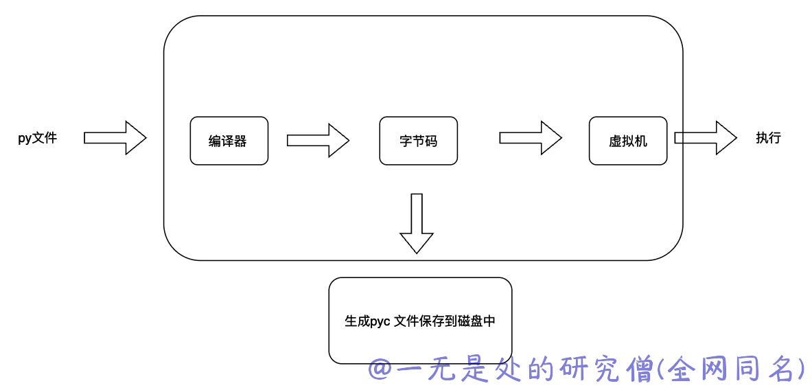
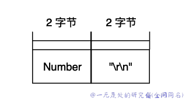

# 深入理解 python 虚拟机：pyc 文件结构

在本篇文章当中主要给大姐介绍一下 .py 文件在被编译之后对应的 pyc 文件结构，pyc 文件当中的一个核心内容就是 python 字节码。

## pyc 文件

pyc 文件是 Python 在解释执行源代码时生成的一种字节码文件，它包含了源代码的编译结果和相关的元数据信息，以便于 Python 可以更快地加载和执行代码。

Python 是一种解释型语言，它不像编译型语言那样将源代码直接编译成机器码执行。Python 的解释器会在运行代码之前先将源代码编译成字节码，然后将字节码解释执行。.pyc 文件就是这个过程中生成的字节码文件。

当 Python 解释器首次执行一个 .py 文件时，它会在同一目录下生成一个对应的 .pyc 文件，以便于下次加载该文件时可以更快地执行。如果源文件在修改之后被重新加载，解释器会重新生成 .pyc 文件以更新缓存的字节码。

## 生成 pyc 文件

正常的 python 文件需要通过编译器变成字节码，然后将字节码交给 python 虚拟机，然后 python 虚拟机会执行字节码。整体流程如下所示：



我们可以直接使用 compile all 模块生成对应文件的 pyc 文件。

```bash
➜  pvm ls
demo.py  hello.py
➜  pvm python -m compileall .
Listing '.'...
Listing './.idea'...
Listing './.idea/inspectionProfiles'...
Compiling './demo.py'...
Compiling './hello.py'...
➜  pvm ls
__pycache__ demo.py     hello.py
➜  pvm ls __pycache__ 
demo.cpython-310.pyc  hello.cpython-310.pyc
```

`python -m compileall .` 命令将递归扫描当前目录下面的 py 文件，并且生成对应文件的 pyc 文件。

## pyc 文件布局


第一部分魔数由两部分组成：



第一部分是一个 2 字节的整数，第二部分是两个字符 "\r\n" 也占用两个字节，一共是四个字节。这个两个字节的整数在不同的 python 版本还不一样，比如说在 python3.5 当中这个值为 3351 等值，在 python3.9 当中这个值为 3420，3421，3422，3423，3424等值（在 python 3.9 的小版本）。

第二部分 Bit Field 这个字段的主要作用是为了将来能够实现复现编译结果，但是在 python3.9a2 时，这个字段的值还全部是 0 。

第三部分 就是整个 pyc 文件的大小了。

第四部分 也是整个 pyc 文件当中最重要的一个部分，最后一个部分就是一个 CodeObject 对象序列化之后的数据，我们稍后再来仔细分析一下这个对象相关的数据。

我们现在来具体分析一个 pyc 文件，对应的 python 代码为：

```python
def f():
    x = 1
    return 2
```

pyc 文件的十六进制形式如下所示：

```bash
➜  __pycache__ hexdump -C hello.cpython-310.pyc
00000000  6f 0d 0d 0a 00 00 00 00  b9 48 21 64 20 00 00 00  |o........H!d ...|
00000010  e3 00 00 00 00 00 00 00  00 00 00 00 00 00 00 00  |................|
00000020  00 02 00 00 00 40 00 00  00 73 0c 00 00 00 64 00  |.....@...s....d.|
00000030  64 01 84 00 5a 00 64 02  53 00 29 03 63 00 00 00  |d...Z.d.S.).c...|
00000040  00 00 00 00 00 00 00 00  00 01 00 00 00 01 00 00  |................|
00000050  00 43 00 00 00 73 08 00  00 00 64 01 7d 00 64 02  |.C...s....d.}.d.|
00000060  53 00 29 03 4e e9 01 00  00 00 e9 02 00 00 00 a9  |S.).N...........|
00000070  00 29 01 da 01 78 72 03  00 00 00 72 03 00 00 00  |.)...xr....r....|
00000080  fa 0a 2e 2f 68 65 6c 6c  6f 2e 70 79 da 01 66 01  |.../hello.py..f.|
00000090  00 00 00 73 04 00 00 00  04 01 04 01 72 06 00 00  |...s........r...|
000000a0  00 4e 29 01 72 06 00 00  00 72 03 00 00 00 72 03  |.N).r....r....r.|
000000b0  00 00 00 72 03 00 00 00  72 05 00 00 00 da 08 3c  |...r....r......<|
000000c0  6d 6f 64 75 6c 65 3e 01  00 00 00 73 02 00 00 00  |module>....s....|
000000d0  0c 00                                             |..|
000000d2
```

