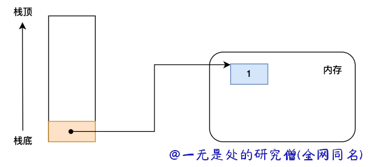
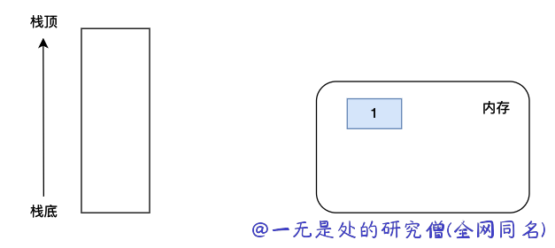
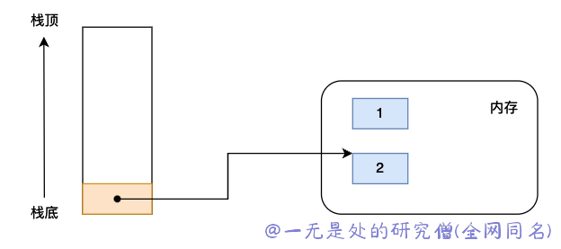
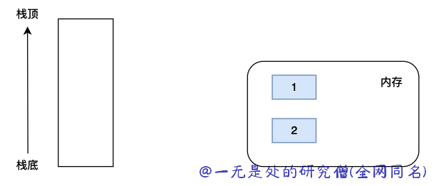
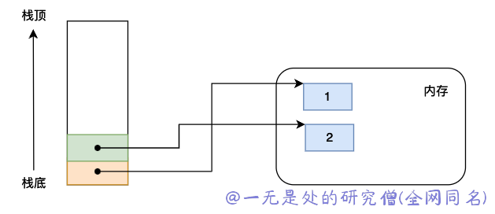

# 深入理解 python 虚拟机：字节码灵魂——Code obejct

在本篇文章当中主要给大家深入介绍在 cpython 当中非常重要的一个数据结构 code object! 在上一篇文章 [深入理解 python 虚拟机：pyc 文件结构](https://mp.weixin.qq.com/s?__biz=Mzg3ODgyNDgwNg==&mid=2247488040&idx=1&sn=665b5b6080d5ec7910f586b252281bcf&chksm=cf0c8e21f87b073748c82af61a5c7c9d73bca95e5b6558d50d1d5b1cc97e50c4a93d9daffcfa&token=1257007364&lang=zh_CN#rd) ，我们简单介绍了一下在 code object 当中有哪些字段以及这些字段的简单含义。

## Code Object 数据结构

```c
typedef struct {
    PyObject_HEAD
    int co_argcount;		/* #arguments, except *args */
    int co_kwonlyargcount;	/* #keyword only arguments */
    int co_nlocals;		/* #local variables */
    int co_stacksize;		/* #entries needed for evaluation stack */
    int co_flags;		/* CO_..., see below */
    PyObject *co_code;		/* instruction opcodes */
    PyObject *co_consts;	/* list (constants used) */
    PyObject *co_names;		/* list of strings (names used) */
    PyObject *co_varnames;	/* tuple of strings (local variable names) */
    PyObject *co_freevars;	/* tuple of strings (free variable names) */
    PyObject *co_cellvars;      /* tuple of strings (cell variable names) */
    /* The rest aren't used in either hash or comparisons, except for
       co_name (used in both) and co_firstlineno (used only in
       comparisons).  This is done to preserve the name and line number
       for tracebacks and debuggers; otherwise, constant de-duplication
       would collapse identical functions/lambdas defined on different lines.
    */
    unsigned char *co_cell2arg; /* Maps cell vars which are arguments. */
    PyObject *co_filename;	/* unicode (where it was loaded from) */
    PyObject *co_name;		/* unicode (name, for reference) */
    int co_firstlineno;		/* first source line number */
    PyObject *co_lnotab;	/* string (encoding addr<->lineno mapping) See
				   Objects/lnotab_notes.txt for details. */
    void *co_zombieframe;     /* for optimization only (see frameobject.c) */
    PyObject *co_weakreflist;   /* to support weakrefs to code objects */
} PyCodeObject;
```

下面是 code object 当中各个字段的作用：

- 首先需要了解一下代码块这个概念，所谓代码块就是一个小的 python 代码，被当做一个小的单元整体执行。在 python 当中常见的代码块块有：函数体、类的定义、一个模块。

- argcount，这个表示一个代码块的参数个数，这个参数只对函数体代码块有用，因为函数可能会有参数，比如上面的 pycdemo.py 是一个模块而不是一个函数，因此这个参数对应的值为 0 。
- co_code，这个对象的具体内容就是一个字节序列，存储真实的 python 字节码，主要是用于 python 虚拟机执行的，在本篇文章当中暂时不详细分析。
- co_consts，这个字段是一个列表类型的字段，主要是包含一些字符串常量和数值常量，比如上面的 "\_\_main\_\_" 和 100 。
- co_filename，这个字段的含义就是对应的源文件的文件名。
- co_firstlineno，这个字段的含义为在 python 源文件当中第一行代码出现的行数，这个字段在进行调试的时候非常重要。
- co_flags，这个字段的主要含义就是标识这个 code object 的类型。0x0080 表示这个 block 是一个协程，0x0010 表示这个 code object 是嵌套的等等。

- co_lnotab，这个字段的含义主要是用于计算每个字节码指令对应的源代码行数。
- co_varnames，这个字段的主要含义是表示在一个 code object 本地定义的一个名字。
- co_names，和 co_varnames 相反，表示非本地定义但是在 code object 当中使用的名字。

- co_nlocals，这个字段表示在一个 code object 当中本地使用的变量个数。
- co_stackszie，因为 python 虚拟机是一个栈式计算机，这个参数的值表示这个栈需要的最大的值。
- co_cellvars，co_freevars，这两个字段主要和嵌套函数和函数闭包有关，我们在后续的文章当中将详细解释这个字段。

## 	CodeObject 详细分析

现在我们使用一些实际的例子来分析具体的 code object 。

```python
import dis
import binascii
import types

d = 10


def test_co01(c):
    a = 1
    b = 2
    return a + b + c + d
```

在前面的文章当中我们提到过一个函数是包括一个 code object 对象，test_co01 的 code object 对象的输出结果（完整代码见[co01](https://github.com/Chang-LeHung/dive-into-cpython/blob/master/code/codeobject/co01.py)）如下所示：

```bash
code
   argcount 1
   nlocals 3
   stacksize 2
   flags 0043 0x43
   code b'6401007d01006402007d02007c01007c0200177c0000177400001753'
  9           0 LOAD_CONST               1 (1)
              3 STORE_FAST               1 (a)

 10           6 LOAD_CONST               2 (2)
              9 STORE_FAST               2 (b)

 11          12 LOAD_FAST                1 (a)
             15 LOAD_FAST                2 (b)
             18 BINARY_ADD
             19 LOAD_FAST                0 (c)
             22 BINARY_ADD
             23 LOAD_GLOBAL              0 (d)
             26 BINARY_ADD
             27 RETURN_VALUE
   consts
      None
      1
      2
   names ('d',)
   varnames ('c', 'a', 'b')
   freevars ()
   cellvars ()
   filename '/tmp/pycharm_project_396/co01.py'
   name 'test_co01'
   firstlineno 8
   lnotab b'000106010601'
```

- 字段 argcount 的值等于 1，说明函数有一个参数，这个函数 test_co01 有一个参数 c 是相互对应的。
- 字段 nlocals 的值等于 3，说明在函数 test_co01 当中一个一共实现了三个函数本地变量 a, b, c 。
- 字段 names，对应代码代码当中的 co_names，根据前面的定义就是 d 这个全局变量在函数  test_co01 当中使用，但是却没有在函数当中定义了。
- 字段 varnames，这个就表示在本地定义使用的变量了，在函数 test_co01 当中主要有三个变量 a, b, c 。
- 字段 filename，就是 python 文件的地址了。
- 字段 firstlineno 说明函数的第一行出现在对应 python 代码的 第 8 行。

### Flags 字段详细分析

我们具体使用 python3.5 的源代码进行分析，在 cpython 虚拟机的具体实现如下所示（Include/code.h）：

```c
/* Masks for co_flags above */
#define CO_OPTIMIZED	0x0001
#define CO_NEWLOCALS	0x0002
#define CO_VARARGS	0x0004
#define CO_VARKEYWORDS	0x0008
#define CO_NESTED       0x0010
#define CO_GENERATOR    0x0020
/* The CO_NOFREE flag is set if there are no free or cell variables.
   This information is redundant, but it allows a single flag test
   to determine whether there is any extra work to be done when the
   call frame it setup.
*/
#define CO_NOFREE       0x0040

/* The CO_COROUTINE flag is set for coroutine functions (defined with
   ``async def`` keywords) */
#define CO_COROUTINE            0x0080
#define CO_ITERABLE_COROUTINE   0x0100
```

如果 flags 字段和上面的各个宏定义进行 & 运算，如果得到的结果大于 0，则说明符合对应的条件。

上面的宏定义的含义如下所示：

- **CO_OPTIMIZED**，这个字段表示 code object 是被优化过的，使用函数本地定义的变量。
- **CO_NEWLOCALS**，这个字段的含义为当这个 code object 的代码被执行的时候会给栈帧当中的 f_locals 对象创建一个 dict 对象。

- **CO_VARARGS**，表示这个 code object 对象是否含有位置参数。
- **CO_VARKEYWORDS**，表示这个 code object 是否含有关键字参数。
- **CO_NESTED**，表示这个 code object 是一个嵌套函数。
- **CO_GENERATOR**，表示这个 code object 是一个生成器。
- **CO_COROUTINE**，表示这个 code object 是一个协程函数。
- **CO_ITERABLE_COROUTINE**，表示 code object 是一个可迭代的协程函数。
- **CO_NOFREE**，这个表示没有 freevars 和 cellvars，即没有函数闭包。

现在再分析一下前面的函数 test_co01 的 flags，他对应的值等于 0x43，则说明这个函数满足三个特性分别是 CO_NEWLOCALS，CO_OPTIMIZED 和 CO_NOFREE。

### freevars & cellvars

我们使用下面的函数来对这两个字段进行分析：

```python
def test_co02():
    a = 1
    b = 2

    def g():
        return a + b
    return a + b + g()
```

上面的函数的信息如下所示（完整代码见[co02](https://github.com/Chang-LeHung/dive-into-cpython/blob/master/code/codeobject/co01.py)）：

```bash
code
   argcount 0
   nlocals 1
   stacksize 3
   flags 0003 0x3
   code
      b'640100890000640200890100870000870100660200640300640400860000'
      b'7d0000880000880100177c00008300001753'
 15           0 LOAD_CONST               1 (1)
              3 STORE_DEREF              0 (a)

 16           6 LOAD_CONST               2 (2)
              9 STORE_DEREF              1 (b)

 18          12 LOAD_CLOSURE             0 (a)
             15 LOAD_CLOSURE             1 (b)
             18 BUILD_TUPLE              2
             21 LOAD_CONST               3 (<code object g at 0x7f133ff496f0, file "/tmp/pycharm_project_396/co01.py", line 18>)
             24 LOAD_CONST               4 ('test_co02.<locals>.g')
             27 MAKE_CLOSURE             0
             30 STORE_FAST               0 (g)

 20          33 LOAD_DEREF               0 (a)
             36 LOAD_DEREF               1 (b)
             39 BINARY_ADD
             40 LOAD_FAST                0 (g)
             43 CALL_FUNCTION            0 (0 positional, 0 keyword pair)
             46 BINARY_ADD
             47 RETURN_VALUE
   consts
      None
      1
      2
      code
         argcount 0
         nlocals 0
         stacksize 2
         flags 0013 0x13
         code b'8800008801001753'
 19           0 LOAD_DEREF               0 (a)
              3 LOAD_DEREF               1 (b)
              6 BINARY_ADD
              7 RETURN_VALUE
         consts
            None
         names ()
         varnames ()
         freevars ('a', 'b')
         cellvars ()
         filename '/tmp/pycharm_project_396/co01.py'
         name 'g'
         firstlineno 18
         lnotab b'0001'
      'test_co02.<locals>.g'
   names ()
   varnames ('g',)
   freevars ()
   cellvars ('a', 'b')
   filename '/tmp/pycharm_project_396/co01.py'
   name 'test_co02'
   firstlineno 14
   lnotab b'0001060106021502'
```

从上面的输出我们可以看到的是，函数 test_co02 的 cellvars 为 ('a', 'b')，函数 g 的 freevars 为 ('a', 'b')，cellvars 表示在其他函数当中会使用本地定义的变量，freevars 表示本地会使用其他函数定义的变量。

再来分析一下函数 test_co02 的 flags，他的 flags 等于 0x3 因为有闭包的存在因此 flags 不会存在 CO_NOFREE，也就是少了值 0x0040 。

### stacksize

这个字段存储的是在函数在被虚拟机执行的时候所需要的最大的栈空间的大小，这也是一种优化手段，因为在知道所需要的最大的栈空间，所以可以在函数执行的时候直接分配指定大小的空间不需要在函数执行的时候再去重新扩容。

```python
def test_stack():
    a = 1
    b = 2
    return a + b
```

上面的代码相关字节码等信息如下所示：

```bash
code
   argcount 0
   nlocals 2
   stacksize 2
   flags 0043 0x43
   code b'6401007d00006402007d01007c00007c01001753'
   #					  字节码指令		 # 字节码指令参数 # 参数对应的值
 24           0 LOAD_CONST               1 (1)
              3 STORE_FAST               0 (a)

 25           6 LOAD_CONST               2 (2)
              9 STORE_FAST               1 (b)

 26          12 LOAD_FAST                0 (a)
             15 LOAD_FAST                1 (b)
             18 BINARY_ADD
             19 RETURN_VALUE
   consts
      None # 下标等于 0 的常量
      1 	 # 下标等于 1 的常量
      2		 # 下标等于 2 的常量
   names ()
   varnames ('a', 'b')
   freevars ()
   cellvars ()
```

我们现在来模拟一下执行过程，在模拟之前我们首先来了解一下上面几条字节码的作用：

- LOAD_CONST，将常量表当中的下标等于 i 个对象加载到栈当中，对应上面的代码  LOAD_CONST 的参数 i = 1。因此加载测常量等于 1 。因此现在栈空间如下所示：



- STORE_FAST，将栈顶元素弹出并且保存到 co_varnames 对应的下标当中，根据上面的字节码参数等于 0 ，因此将 1 保存到 co_varnames[0] 对应的对象当中。



- LOAD_CONST，将下标等于 2 的常量加载进入栈中。



- STORE_FAST，将栈顶元素弹出，并且保存到 varnames 下标为 1 的对象。



- LOAD_FAST，是取出 co_varnames 对应下标的数据，并且将其压入栈中。我们直接连续执行两个 LOAD_FAST 之后栈空间的布局如下：



- BINARY_ADD，这个字节码指令是将栈空间的两个栈顶元素弹出，然后将两个数据进行相加操作，然后将相加得到的结果重新压入栈中。


