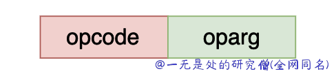
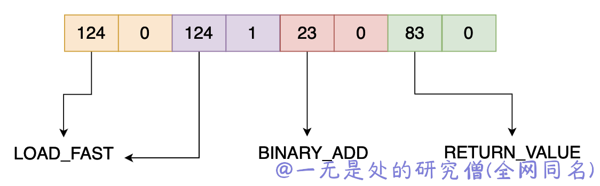

# 深入理解 python 虚拟机：令人拍案叫绝的字节码设计

在本篇文章当中主要给大家介绍 cpython 虚拟机对于字节码的设计以及在调试过程当中一个比较重要的字段 co_lnotab 的设计原理！

## python 字节码设计

一条 python 字节码主要有两部分组成，一部分是操作码，一部分是这个操作码的参数，在 cpython 当中只有部分字节码有参数，如果对应的字节码没有参数，那么 oparg 的值就等于 0 ，在 cpython 当中 opcode < 90 的指令是没有参数的。



opcode 和 oparg 各占一个字节，cpython 虚拟机使用小端方式保存字节码。

我们使用下面的代码片段先了解一下字节码的设计：

```python
import dis


def add(a, b):
    return a + b


if __name__ == '__main__':
    print(add.__code__.co_code)
    print("bytecode: ", list(bytearray(add.__code__.co_code)))
    dis.dis(add)
```

上面的代码在 python3.9 的输出如下所示：

```bash
b'|\x00|\x01\x17\x00S\x00'
bytecode:  [124, 0, 124, 1, 23, 0, 83, 0]
  5           0 LOAD_FAST                0 (a)
              2 LOAD_FAST                1 (b)
              4 BINARY_ADD
              6 RETURN_VALUE
```

首先 需要了解的是 add.\_\_code\_\_.co\_code 是函数 add 的字节码，是一个字节序列，`list(bytearray(add.__code__.co_code))` 是将和这个序列一个字节一个字节进行分开，并且将其变成 10 进制形式。根据前面我们谈到的每一条指令——字节码占用 2 个字节，因此上面的字节码有四条指令：


操作码和对应的操作指令在文末有详细的对应表。在上面的代码当中主要使用到了三个字节码指令分别是 124，23 和 83 ，他们对应的操作指令分别为 LOAD_FAST，BINARY_ADD，RETURN_VALUE。他们的含义如下：

- LOAD_FAST：将 varnames[var_num] 压入栈顶。
- BINARY_ADD：从栈中弹出两个对象并且将它们相加的结果压入栈顶。
- RETURN_VALUE：弹出栈顶的元素，将其作为函数的返回值。

首先我们需要知道的是 BINARY_ADD 和 RETURN_VALUE，这两个操作指令是没有参数的，因此在这两个操作码之后的参数都是 0 。

但是 LOAD_FAST 是有参数的，在上面我们已经知道 LOAD_FAST 是将 co-varnames[var_num] 压入栈，var_num 就是指令 LOAD_FAST 的参数。在上面的代码当中一共有两条 LOAD_FAST 指令，分别是将 a 和 b 压入到栈中，他们在 varnames 当中的下标分别是 0 和 1，因此他们的操作数就是 0 和 1 。

## 字节码扩展参数

在上面我们谈到的 python 字节码操作数和操作码各占一个字节，但是如果 varnames 或者常量表的数据的个数大于 1 个字节的表示范围的话那么改如何处理呢？

为了解决这个问题，cpython 为字节码设计的扩展参数，比如说我们要加载常量表当中的下标为 66113 的对象，那么对应的字节码如下：

```python
[144, 1, 144, 2, 100, 65]
```

其中 144 表示 EXTENDED_ARG，他本质上不是一个 python 虚拟机需要执行的字节码，这个字段设计出来主要是为了用与计算扩展参数的。

100 对应的操作指令是 LOAD_CONST ，其操作码是 65，但是上面的指令并不会加载常量表当中下标为 65 对象，而是会加载下标为 66113 的对象，原因就是因为  EXTENDED_ARG 。

现在来模拟一下上面的分析过程：

- 先读取一条字节码指令，操作码等于 144 ，说明是扩展参数，那么此时的参数 arg 就等于 (1 x (1 << 8)) = 256 。
- 读取第二条字节码指令，操作码等于 144 ，说明是扩展参数，因为前面 arg 已经存在切不等于 0 了，那么此时 arg 的计算方式已经发生了改变，arg = arg << 8 + 2 << 8 ，也就是说原来的 arg 乘以 256 再加上新的操作数乘以 256 ，此时 arg = 66048 。
- 读取第三条字节码指令，操作码等于 100，此时是 LOAD_CONST 这条指令，那么此时的操作码等于 arg += 65，因为操作码不是 EXTENDED_ARG 因此操作数不需要在乘以 256 了。

上面的计算过程用程序代码表示如下，下面的代码当中 code 就是真正的字节序列 HAVE_ARGUMENT = 90 。

```python
def _unpack_opargs(code):
    extended_arg = 0
    for i in range(0, len(code), 2):
        op = code[i]
        if op >= HAVE_ARGUMENT:
            arg = code[i+1] | extended_arg
            extended_arg = (arg << 8) if op == EXTENDED_ARG else 0
        else:
            arg = None
        yield (i, op, arg)
```

我们可以使用代码来验证我们前面的分析：

```python
import dis


def num_to_byte(n):
    return n.to_bytes(1, "little")


def nums_to_bytes(data):
    ans = b"".join([num_to_byte(n) for n in data])
    return ans


if __name__ == '__main__':
    # extended_arg extended_num opcode oparg for python_version > 3.5
    bytecode = nums_to_bytes([144, 1, 144, 2, 100, 65])
    print(bytecode)
    dis.dis(bytecode)
```

上面的代码输出结果如下所示：

```bash
b'\x90\x01\x90\x02dA'
          0 EXTENDED_ARG             1
          2 EXTENDED_ARG           258
          4 LOAD_CONST           66113 (66113)
```

根据上面程序的输出结果可以看到我们的分析结果是正确的。

## python 字节码表

|操作|操作码|
|---|---|
|POP_TOP|1|
|ROT_TWO|2|
|ROT_THREE|3|
|DUP_TOP|4|
|DUP_TOP_TWO|5|
|ROT_FOUR|6|
|NOP|9|
|UNARY_POSITIVE|10|
|UNARY_NEGATIVE|11|
|UNARY_NOT|12|
|UNARY_INVERT|15|
|BINARY_MATRIX_MULTIPLY|16|
|INPLACE_MATRIX_MULTIPLY|17|
|BINARY_POWER|19|
|BINARY_MULTIPLY|20|
|BINARY_MODULO|22|
|BINARY_ADD|23|
|BINARY_SUBTRACT|24|
|BINARY_SUBSCR|25|
|BINARY_FLOOR_DIVIDE|26|
|BINARY_TRUE_DIVIDE|27|
|INPLACE_FLOOR_DIVIDE|28|
|INPLACE_TRUE_DIVIDE|29|
|RERAISE|48|
|WITH_EXCEPT_START|49|
|GET_AITER|50|
|GET_ANEXT|51|
|BEFORE_ASYNC_WITH|52|
|END_ASYNC_FOR|54|
|INPLACE_ADD|55|
|INPLACE_SUBTRACT|56|
|INPLACE_MULTIPLY|57|
|INPLACE_MODULO|59|
|STORE_SUBSCR|60|
|DELETE_SUBSCR|61|
|BINARY_LSHIFT|62|
|BINARY_RSHIFT|63|
|BINARY_AND|64|
|BINARY_XOR|65|
|BINARY_OR|66|
|INPLACE_POWER|67|
|GET_ITER|68|
|GET_YIELD_FROM_ITER|69|
|PRINT_EXPR|70|
|LOAD_BUILD_CLASS|71|
|YIELD_FROM|72|
|GET_AWAITABLE|73|
|LOAD_ASSERTION_ERROR|74|
|INPLACE_LSHIFT|75|
|INPLACE_RSHIFT|76|
|INPLACE_AND|77|
|INPLACE_XOR|78|
|INPLACE_OR|79|
|LIST_TO_TUPLE|82|
|RETURN_VALUE|83|
|IMPORT_STAR|84|
|SETUP_ANNOTATIONS|85|
|YIELD_VALUE|86|
|POP_BLOCK|87|
|POP_EXCEPT|89|
|STORE_NAME|90|
|DELETE_NAME|91|
|UNPACK_SEQUENCE|92|
|FOR_ITER|93|
|UNPACK_EX|94|
|STORE_ATTR|95|
|DELETE_ATTR|96|
|STORE_GLOBAL|97|
|DELETE_GLOBAL|98|
|LOAD_CONST|100|
|LOAD_NAME|101|
|BUILD_TUPLE|102|
|BUILD_LIST|103|
|BUILD_SET|104|
|BUILD_MAP|105|
|LOAD_ATTR|106|
|COMPARE_OP|107|
|IMPORT_NAME|108|
|IMPORT_FROM|109|
|JUMP_FORWARD|110|
|JUMP_IF_FALSE_OR_POP|111|
|JUMP_IF_TRUE_OR_POP|112|
|JUMP_ABSOLUTE|113|
|POP_JUMP_IF_FALSE|114|
|POP_JUMP_IF_TRUE|115|
|LOAD_GLOBAL|116|
|IS_OP|117|
|CONTAINS_OP|118|
|JUMP_IF_NOT_EXC_MATCH|121|
|SETUP_FINALLY|122|
|LOAD_FAST|124|
|STORE_FAST|125|
|DELETE_FAST|126|
|RAISE_VARARGS|130|
|CALL_FUNCTION|131|
|MAKE_FUNCTION|132|
|BUILD_SLICE|133|
|LOAD_CLOSURE|135|
|LOAD_DEREF|136|
|STORE_DEREF|137|
|DELETE_DEREF|138|
|CALL_FUNCTION_KW|141|
|CALL_FUNCTION_EX|142|
|SETUP_WITH|143|
|LIST_APPEND|145|
|SET_ADD|146|
|MAP_ADD|147|
|LOAD_CLASSDEREF|148|
|EXTENDED_ARG|144|
|SETUP_ASYNC_WITH|154|
|FORMAT_VALUE|155|
|BUILD_CONST_KEY_MAP|156|
|BUILD_STRING|157|
|LOAD_METHOD|160|
|CALL_METHOD|161|
|LIST_EXTEND|162|
|SET_UPDATE|163|
|DICT_MERGE|164|
|DICT_UPDATE|165|
