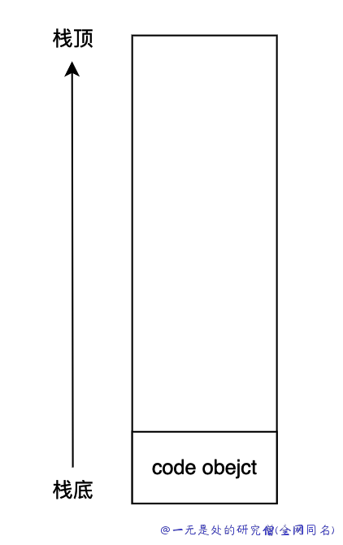
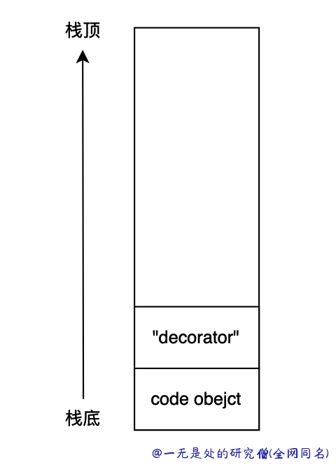
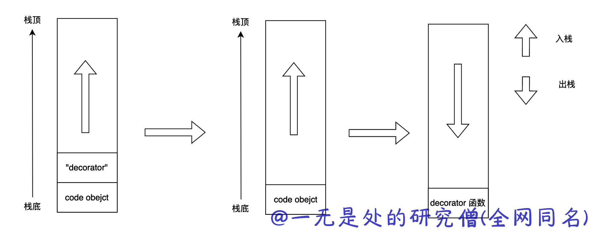

# 深入理解 python 虚拟机：字节码教程(1)——模拟python程序的执行

在本篇文章当中主要给大家介绍在 cpython 当中一些比较常见的字节码，从根本上理解 python 程序的执行。在本文当中主要介绍一些 python 基本操作的字节码，并且将从字节码的角度分析函数装饰器的原理！

## Python 常见字节码

### LOAD_CONST

这个指令用于将一个常量加载到栈中。常量可以是数字、字符串、元组、列表、字典等对象。例如：

```python
>>> dis.dis(lambda: 42)
  1           0 LOAD_CONST               1 (42)
              2 RETURN_VALUE
```

### LOAD_NAME

这个指令用于将一个变量加载到栈中。例如：

```python
>>> dis.dis(lambda: x)
  1           0 LOAD_GLOBAL              0 (x)
              2 RETURN_VALUE
>>>
```

### STORE_NAME

这个指令用于将栈顶的值存储到一个变量中。例如：

```python
>>> dis.dis("x=42")
  1           0 LOAD_CONST               0 (42)
              2 STORE_NAME               0 (x)
              4 LOAD_CONST               1 (None)
              6 RETURN_VALUE
```

### BINARY_ADD

这个指令用于对栈顶的两个值进行加法运算并将结果推送到栈中。

```python
>>> dis.dis(lambda: x + y)
  1           0 LOAD_GLOBAL              0 (x)
              2 LOAD_GLOBAL              1 (y)
              4 BINARY_ADD
              6 RETURN_VALUE
```

### BINARY_SUBTRACT

这个指令用于对栈顶的两个值进行减法运算并将结果推送到栈中。

```python
>>> dis.dis(lambda: x - y)
  1           0 LOAD_GLOBAL              0 (x)
              2 LOAD_GLOBAL              1 (y)
              4 BINARY_SUBTRACT
              6 RETURN_VALUE
```

### COMPARE_OP

这个指令用于比较栈顶的两个值，并且将比较得到的结果压入栈中，这个字节码后面后一个字节的参数，表示小于大于不等于等等比较符号。例如：

```python
>>> dis.dis(lambda: x - y)
  1           0 LOAD_GLOBAL              0 (x)
              2 LOAD_GLOBAL              1 (y)
              4 BINARY_SUBTRACT
              6 RETURN_VALUE
>>> dis.dis(lambda: x > y)
  1           0 LOAD_GLOBAL              0 (x)
              2 LOAD_GLOBAL              1 (y)
              4 COMPARE_OP               4 (>)
              6 RETURN_VALUE
>>> dis.dis(lambda: x < y)
  1           0 LOAD_GLOBAL              0 (x)
              2 LOAD_GLOBAL              1 (y)
              4 COMPARE_OP               0 (<)
              6 RETURN_VALUE
>>> dis.dis(lambda: x != y)
  1           0 LOAD_GLOBAL              0 (x)
              2 LOAD_GLOBAL              1 (y)
              4 COMPARE_OP               3 (!=)
              6 RETURN_VALUE
>>> dis.dis(lambda: x <= y)
  1           0 LOAD_GLOBAL              0 (x)
              2 LOAD_GLOBAL              1 (y)
              4 COMPARE_OP               1 (<=)
              6 RETURN_VALUE
>>> dis.dis(lambda: x >= y)
  1           0 LOAD_GLOBAL              0 (x)
              2 LOAD_GLOBAL              1 (y)
              4 COMPARE_OP               5 (>=)
              6 RETURN_VALUE
>>> dis.dis(lambda: x == y)
  1           0 LOAD_GLOBAL              0 (x)
              2 LOAD_GLOBAL              1 (y)
              4 COMPARE_OP               2 (==)
              6 RETURN_VALUE
```

### RETURN_VALUE

将栈顶元素弹出作为返回值。

### BUILD_LIST

这个指令用于创建一个列表。例如：

```python
>>> dis.dis(lambda: [a, b, c, e])
  1           0 LOAD_GLOBAL              0 (a)
              2 LOAD_GLOBAL              1 (b)
              4 LOAD_GLOBAL              2 (c)
              6 LOAD_GLOBAL              3 (e)
              8 BUILD_LIST               4
             10 RETURN_VALUE
```

这条字节码指令有一个参数表示栈空间当中列表元素的个数，在上面的例子当中这个参数是 4 。

### BUILD_TUPLE

这个指令用于创建一个元组。例如：

```python
>>> dis.dis(lambda: (a, b, c))
  1           0 LOAD_GLOBAL              0 (a)
              2 LOAD_GLOBAL              1 (b)
              4 LOAD_GLOBAL              2 (c)
              6 BUILD_TUPLE              3
              8 RETURN_VALUE
```

同样的这个字节码也有一个参数，表示创建元组的元素个数。

### BUILD_MAP

这个指令用于创建一个字典。例如：

```python

```

### BUILD_SET

和 list 和 tuple 一样，这条指令是用于创建一个集合对象，同样的这条指令也有一个参数表示用于创建集合的元素的个数。

```python
>>> dis.dis(lambda: {a, b, c, d})
  1           0 LOAD_GLOBAL              0 (a)
              2 LOAD_GLOBAL              1 (b)
              4 LOAD_GLOBAL              2 (c)
              6 LOAD_GLOBAL              3 (d)
              8 BUILD_SET                4
             10 RETURN_VALUE
```

### BUILD_CONST_KEY_MAP

这条指令是用于创建一个字典对象，同样的这条指令也有一个参数，表示字典当中元素的个数。

```python
>>> dis.dis(lambda: {1:2, 3:4})
  1           0 LOAD_CONST               1 (2)
              2 LOAD_CONST               2 (4)
              4 LOAD_CONST               3 ((1, 3))
              6 BUILD_CONST_KEY_MAP      2
              8 RETURN_VALUE
```

## 从字节码角度分析装饰器的原理

如果你是一个 pythoner 那么你肯定或多或少听说过装饰器，这是一个 python 的语法糖我们可以用它来做很多有趣的事情，比如在不修改源代码的基础之上给函数附加一些功能，比如说计算时间。

```python
import time

def eval_time(func):
    
    def cal_time(*args, **kwargs):
        start = time.time()
        r = func(*args, **kwargs)
        end = time.time()
        return r, end - start
    return cal_time


@eval_time
def fib(n):
    a = 0
    b = 1
    while n > 0:
        n -= 1
        a, b = b, a + b
    return a
```

在上面的代码当中我们实现了一个计算斐波拉契数列的函数，除此之外还写了一个 eval_time 函数用于计算函数执行的时间，现在调用函数 fib(10)，程序的输出如下所示：

```bash
>>>fib(10)
(55, 5.9604644775390625e-06)
```

可以看到实现了我们想要的效果。

现在我们使用一个更加简单的例子来模拟上面的代码结构，方便我们对上面函数执行的过程进行分析：

```python
s = """
def decorator(func):
    print("Hello")
    return func

@decorator
def fib(n):
    pass
"""
dis.dis(s)
```

上面的 dis 函数的输出对应代码的字节码如下所示：

```bash
  2           0 LOAD_CONST               0 (<code object decorator at 0x108068d40, file "<dis>", line 2>)
              2 LOAD_CONST               1 ('decorator')
              4 MAKE_FUNCTION            0
              6 STORE_NAME               0 (decorator)

  6           8 LOAD_NAME                0 (decorator)

  7          10 LOAD_CONST               2 (<code object fib at 0x1075c1710, file "<dis>", line 6>)
             12 LOAD_CONST               3 ('fib')
             14 MAKE_FUNCTION            0
             16 CALL_FUNCTION            1
             18 STORE_NAME               1 (fib)
             20 LOAD_CONST               4 (None)
             22 RETURN_VALUE

Disassembly of <code object decorator at 0x108068d40, file "<dis>", line 2>:
  3           0 LOAD_GLOBAL              0 (print)
              2 LOAD_CONST               1 ('Hello')
              4 CALL_FUNCTION            1
              6 POP_TOP

  4           8 LOAD_FAST                0 (func)
             10 RETURN_VALUE

Disassembly of <code object fib at 0x1075c1710, file "<dis>", line 6>:
  8           0 LOAD_CONST               0 (None)
              2 RETURN_VALUE
```

- 执行第一条指令 LOAD_CONST，这条指令主要是加载一个 code object 对象，这个对象里面主要是包含函数 decorator 的字节码，主要是上面字节码的第二块内容。在执行完这条字节码之后栈空间如下所示：



- 执行完第二条指令 LOAD_CONST 之后，会将字符串 decorator 加载进入栈空间当中。



- 执行第三条指令 MAKE_FUNCTION，这条字节码的作用是在虚拟机内部创建一个函数，函数的名称为 decorator，函数对应的字节码则是在先前压入栈空间当中的 code object 对象，这条指令还会将创建好的函数对象压入栈中。


