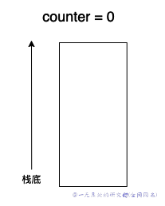
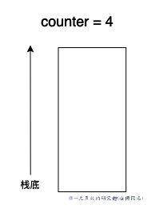
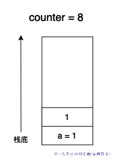
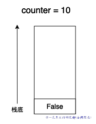
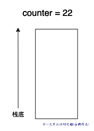
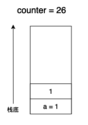
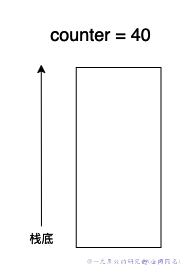
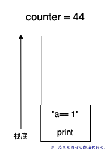
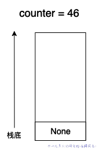

# 深入理解 python 虚拟机：字节码教程(2)——控制流是如何实现的？

在本篇文章当中主要给大家分析 python 当中与控制流有关的字节码，通过对这部分字节码的了解，我们可以更加深入了解 python 字节码的执行过程和控制流实现原理。

## 控制流实现

控制流这部分代码主要涉及下面几条字节码指令，下面的所有字节码指令都会有一个参数：

- **JUMP_FORWARD**，指令完整条指令会将当前执行字节码指令的位置加上这个参数，然后跳到对应的结果继续执行。
- **POP_JUMP_IF_TRUE**，如果栈顶元素等于 true，将字节码的执行位置改成参数的值。将栈顶元素弹出。
- **POP_JUMP_IF_FALSE**，这条指令和 **POP_JUMP_IF_TRUE** 一样，唯一差别就是判断栈顶元素是否等于 true。 
- **JUMP_IF_TRUE_OR_POP**，如果栈顶元素等于等于 true 则将字节码执行位置设置成参数对应的值，并且不需要将栈顶元素弹出。但是如果栈顶元素是 false 的话那么就需要将栈顶元素弹出。
- **JUMP_IF_FALSE_OR_POP**，和**JUMP_IF_TRUE_OR_POP**一样只不过需要栈顶元素等于 false 。
- **JUMP_ABSOLUTE**，直接将字节码的执行位置设置成参数的值。

总的来说，这些跳转指令可以让 Python 的解释器在执行字节码时根据特定条件来改变执行流程，实现循环、条件语句等基本语言结构。

现在我们使用一个例子来深入理解上面的各种指令的执行过程。

```python

import dis


def test_control01():
    a = 1

    if a > 1:
        print("a > 1")
    elif a < 1:
        print("a < 1")
    else:
        print("a == 1")

if __name__ == '__main__':
    dis.dis(test_control01)
```

上面的程序输出结果如下所示：

```bash
  6           0 LOAD_CONST               1 (1)
              2 STORE_FAST               0 (a)

  8           4 LOAD_FAST                0 (a)
              6 LOAD_CONST               1 (1)
              8 COMPARE_OP               4 (>)
             10 POP_JUMP_IF_FALSE       22

  9          12 LOAD_GLOBAL              0 (print)
             14 LOAD_CONST               2 ('a > 1')
             16 CALL_FUNCTION            1
             18 POP_TOP
             20 JUMP_FORWARD            26 (to 48)

 10     >>   22 LOAD_FAST                0 (a)
             24 LOAD_CONST               1 (1)
             26 COMPARE_OP               0 (<)
             28 POP_JUMP_IF_FALSE       40

 11          30 LOAD_GLOBAL              0 (print)
             32 LOAD_CONST               3 ('a < 1')
             34 CALL_FUNCTION            1
             36 POP_TOP
             38 JUMP_FORWARD             8 (to 48)

 13     >>   40 LOAD_GLOBAL              0 (print)
             42 LOAD_CONST               4 ('a == 1')
             44 CALL_FUNCTION            1
             46 POP_TOP
        >>   48 LOAD_CONST               0 (None)
             50 RETURN_VALUE
```

我们现在来模拟一下上面的字节码执行过程，我们使用 counter 表示当前字节码的执行位置：

在字节码还没开始执行之前，栈空间和 counter 的状态如下：



现在执行第一条字节码 LOAD_CONST，执行完之后 counter = 2，因为这条字节码占一个字节，参数栈一个字节，因此下次执行的字节码的位置在 bytecode 的低三个位置，对应的下标为 2，因此 counter = 2 。


现在执行第二条字节码 STORE_FAST，让 a 指向 1 ，同样的 STORE_FAST 操作码和操作数各占一个字节，因此执行完这条字节码之后栈空间没有数据，counter = 4 。



接下来 LOAD_FAST 将 a 指向的对象也就是 1 加载进入栈中，此时的 counter = 6，LOAD_CONST 将常量 1 加载进行入栈空间当中，此时 counter = 8，在执行完这两条指令之后，栈空间的变化如下图所示：



接下来的一条指令是 COMPARE_OP ，这个指令有一个参数表示比较的符号，这里是比较 a > 1，并且会将比较的结果压入栈中，比较的结果是 false ，因为 COMPARE_OP 首先会将栈空间的两个输入弹出，因此在执行完这条指令之后栈空间和 counter 的值如下：



下面一条指令为 POP_JUMP_IF_FALSE，根据前面的字节码含义，这个字节码会将栈顶的 false 弹出，并且会进行跳转，并且将 counter 的值直接编程参数的值，这里他的参数是 22 ，因此 counter = 22，在执行完这条指令之后，结果如下：



因为现在已经跳转到了 22 ，因此接下来执行的指令为 LOAD_FAST，将变量 a 加载进入栈空间，LOAD_CONST 将常量 1 加载进入栈空间，在执行完这两条执行之后，变化情况如下：



在次执行 POP_JUMP_IF_FALSE，这回的结果也是 false ，因此继续执行 POP_JUMP_IF_FALSE，这次的参数是 40，直接将 counter 的值设置成 40 。



接下来 LOAD_GLOBAL 加载一个全局变量 print 函数 counter 变成 42 ，LOAD_CONST 加载字符串 "a == 1" 进入栈空间，counter = 44，此时状态如下：



CALL_FUNCTION 这个字节码有一个参数，表示调用函数的参数的个数，这里是 1，因为 print 函数只有一个参数，然后输出字符串 "a== 1"，但是这里需要注意的是 print 函数会返回一个 None，因此执行完 CALL_FUNCTION 之后状态如下：



至此差不多上面的函数差不多执行完了，后面几条字节码很简单，就不再进行叙述了。

