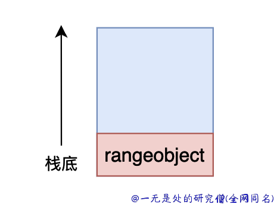
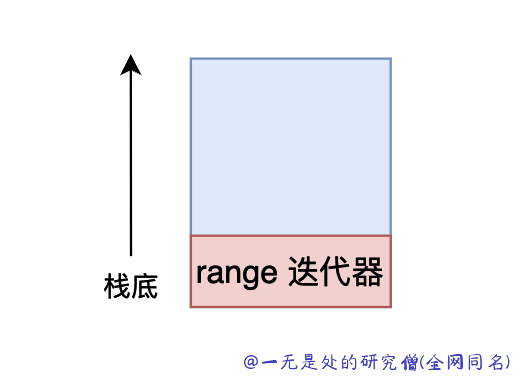
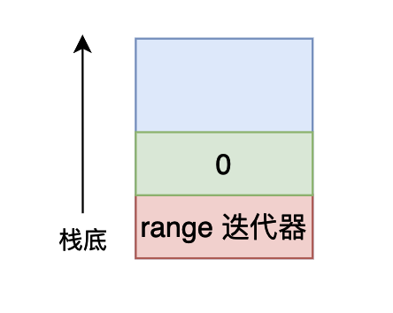

# 深入理解 python 虚拟机：字节码教程(3)——深入剖析循环和异常实现原理

在本篇文章当中主要给大家介绍 cpython 当中跟循环和异常相关的字节码，这部分字节码相比起其他字节码来说相对比较复杂，通过分析这部分字节码我们对程序的执行过程将会有更加深刻的理解。

## 循环

我们使用各种例子来理解和循环相关的字节码：

```python
def test_loop():
    for i in range(10):
        print(i)
```

上面的代码对应的字节码如下所示：

```bash
  8           0 LOAD_GLOBAL              0 (range)
              2 LOAD_CONST               1 (10)
              4 CALL_FUNCTION            1
              6 GET_ITER
        >>    8 FOR_ITER                12 (to 22)
             10 STORE_FAST               0 (i)

  9          12 LOAD_GLOBAL              1 (print)
             14 LOAD_FAST                0 (i)
             16 CALL_FUNCTION            1
             18 POP_TOP
             20 JUMP_ABSOLUTE            8
        >>   22 LOAD_CONST               0 (None)
             24 RETURN_VALUE
```

首先是 range 他对应一个 builtin 的类型，在执行上面的字节码的过程当中，首先先将 range 将在进入栈空间当中，然后将常量 10 加载进入栈空间当中，最后会调用指令 CALL_FUNCTION，这个时候会将栈顶的两个元素弹出，调用 range 类型的创建函数，这个函数会返回一个 range 的实例对象。

这个时候栈的结果如下所示：




接下来的一条字节码为 GET_ITER，这条字节码的含义为，弹出栈顶的对象，并且将弹出的对象变成一个迭代器，并且将得到的迭代器对象再压入栈空间当中。



接下来的一条指令是 FOR_ITER，这条指令的含义为：已知栈顶对象是一个迭代器，调用这个迭代器的 \_\_next\_\_ 函数 ：

- 如果迭代器已经迭代完成了，则将栈顶的迭代器弹出，并且将 bytecode 的 counter 加上对应的参数值，在上面的函数字节码当中这个参数值等于 12 ，也就是说下一条指令为字节码序列的 22 这个位置。
- 如果没有迭代完成则将函数的返回值压入栈顶，并且不需要弹出迭代器，比如当我们第一次调用 \_\_next\_\_ 函数的时候，range 的返回值为0，那么此时栈空间的内容如下所示：


