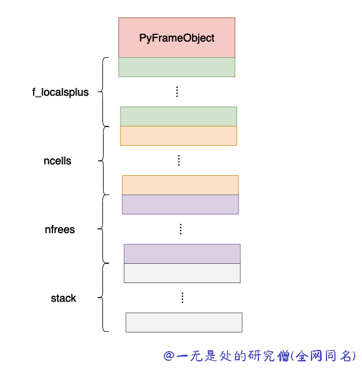
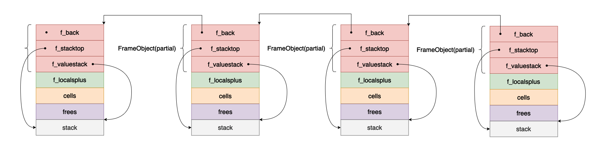

# 深入理解python虚拟机：程序执行的载体——栈帧

栈帧（Stack Frame）是 Python 虚拟机中程序执行的载体之一，也是 Python 中的一种执行上下文。每当 Python 执行一个函数或方法时，都会创建一个栈帧来表示当前的函数调用，并将其压入一个称为调用栈（Call Stack）的数据结构中。调用栈是一个后进先出（LIFO）的数据结构，用于管理程序中的函数调用关系。

栈帧包含了函数的局部变量、参数、返回值、代码执行位置等信息。每个栈帧都有一个独立的命名空间，用于存储局部变量和参数的值。当函数调用结束后，对应的栈帧会从调用栈中弹出，控制权回到上一个栈帧，从而实现函数调用的返回和控制流的转移。

栈帧的创建和销毁是动态的，随着函数的调用和返回而不断发生。当一个函数被调用时，一个新的栈帧会被创建并推入调用栈，当函数调用结束后，对应的栈帧会从调用栈中弹出并销毁。

栈帧的使用使得 Python 能够实现函数的嵌套调用和递归调用。通过不断地创建和销毁栈帧，Python 能够跟踪函数调用关系，保存和恢复局部变量的值，实现函数的嵌套和递归执行。同时，栈帧还可以用于实现异常处理、调试信息的收集和优化技术等。

需要注意的是，栈帧是有限制的，Python 解释器会对栈帧的数量和大小进行限制，以防止栈溢出和资源耗尽的情况发生。在编写 Python 程序时，合理使用函数调用和栈帧可以帮助提高程序的性能和可维护性。

## 栈帧数据结构

```c
typedef struct _frame {
    PyObject_VAR_HEAD
    struct _frame *f_back;      /* previous frame, or NULL */
    PyCodeObject *f_code;       /* code segment */
    PyObject *f_builtins;       /* builtin symbol table (PyDictObject) */
    PyObject *f_globals;        /* global symbol table (PyDictObject) */
    PyObject *f_locals;         /* local symbol table (any mapping) */
    PyObject **f_valuestack;    /* points after the last local */
    /* Next free slot in f_valuestack.  Frame creation sets to f_valuestack.
       Frame evaluation usually NULLs it, but a frame that yields sets it
       to the current stack top. */
    PyObject **f_stacktop;
    PyObject *f_trace;          /* Trace function */

    /* In a generator, we need to be able to swap between the exception
       state inside the generator and the exception state of the calling
       frame (which shouldn't be impacted when the generator "yields"
       from an except handler).
       These three fields exist exactly for that, and are unused for
       non-generator frames. See the save_exc_state and swap_exc_state
       functions in ceval.c for details of their use. */
    PyObject *f_exc_type, *f_exc_value, *f_exc_traceback;
    /* Borrowed reference to a generator, or NULL */
    PyObject *f_gen;

    int f_lasti;                /* Last instruction if called */
    /* Call PyFrame_GetLineNumber() instead of reading this field
       directly.  As of 2.3 f_lineno is only valid when tracing is
       active (i.e. when f_trace is set).  At other times we use
       PyCode_Addr2Line to calculate the line from the current
       bytecode index. */
    int f_lineno;               /* Current line number */
    int f_iblock;               /* index in f_blockstack */
    char f_executing;           /* whether the frame is still executing */
    PyTryBlock f_blockstack[CO_MAXBLOCKS]; /* for try and loop blocks */
    PyObject *f_localsplus[1];  /* locals+stack, dynamically sized */
} PyFrameObject;
```

## 内存申请和栈帧的内存布局

在 cpython 当中，当我们需要申请一个 frame object 对象的时候，首先需要申请内存空间，但是在申请内存空间的时候并不是单单申请一个 frameobject 大小的内存，而是会申请额外的内存空间，大致布局如下所示。



- f_localsplus，这是一个数组用户保存函数执行的 local 变量，这样可以直接通过下标得到对应的变量的值。
- ncells 和 nfrees，这个变量和我们前面在分析 code object 的函数闭包相关，ncells 和 ncells 分别表示 cellvars 和 freevars 中变量的个数。
- stack，这个变量就是函数执行的时候函数的栈帧，这个大小在编译期间就可以确定因此可以直接确定栈空间的大小。

下面是在申请 frame object 的核心代码：

```c
    Py_ssize_t extras, ncells, nfrees;
    ncells = PyTuple_GET_SIZE(code->co_cellvars); // 得到 co_cellvars 当中元素的个数
    nfrees = PyTuple_GET_SIZE(code->co_freevars); // 得到 co_freevars 当中元素的个数
		// extras 就是表示除了申请 frame object 自己的内存之后还需要额外申请多少个 指针对象
		// 确切的带来说是用于保存 PyObject 的指针
    extras = code->co_stacksize + code->co_nlocals + ncells +
        nfrees;
    if (free_list == NULL) {
        f = PyObject_GC_NewVar(PyFrameObject, &PyFrame_Type,
        extras);
        if (f == NULL) {
            Py_DECREF(builtins);
            return NULL;
        }
    }
		// 这个就是函数的 code object 对象 将其保存到栈帧当中 f 就是栈帧对象
    f->f_code = code;
    extras = code->co_nlocals + ncells + nfrees;
    f->f_valuestack = f->f_localsplus + extras;
		// 对额外申请的内存空间尽心初始化操作
    for (i=0; i<extras; i++)
        f->f_localsplus[i] = NULL;
    f->f_locals = NULL;
    f->f_trace = NULL;
    f->f_exc_type = f->f_exc_value = f->f_exc_traceback = NULL;

    f->f_stacktop = f->f_valuestack;
    f->f_builtins = builtins;
    Py_XINCREF(back);
    f->f_back = back;
    Py_INCREF(code);
    Py_INCREF(globals);
    f->f_globals = globals;
    /* Most functions have CO_NEWLOCALS and CO_OPTIMIZED set. */
    if ((code->co_flags & (CO_NEWLOCALS | CO_OPTIMIZED)) ==
        (CO_NEWLOCALS | CO_OPTIMIZED))
        ; /* f_locals = NULL; will be set by PyFrame_FastToLocals() */
    else if (code->co_flags & CO_NEWLOCALS) {
        locals = PyDict_New();
        if (locals == NULL) {
            Py_DECREF(f);
            return NULL;
        }
        f->f_locals = locals;
    }
    else {
        if (locals == NULL)
            locals = globals;
        Py_INCREF(locals);
        f->f_locals = locals;
    }

    f->f_lasti = -1;
    f->f_lineno = code->co_firstlineno;
    f->f_iblock = 0;
    f->f_executing = 0;
    f->f_gen = NULL;
```

现在我们对 frame object 对象当中的各个字段进行分析，说明他们的作用：

- PyObject_VAR_HEAD：表示对象的头部信息，包括引用计数和类型信息。
- f_back：前一个栈帧对象的指针，或者为NULL。
- f_code：指向 PyCodeObject 对象的指针，表示当前帧执行的代码段。
- f_builtins：指向 PyDictObject 对象的指针，表示当前帧的内置符号表，字典对象，键是字符串，值是对应的 python 对象。
- f_globals：指向 PyDictObject 对象的指针，表示当前帧的全局符号表。
- f_locals：指向任意映射对象的指针，表示当前帧的局部符号表。
- f_valuestack：指向当前帧的值栈底部的指针。
- f_stacktop：指向当前帧的值栈顶部的指针。
- f_trace：指向跟踪函数对象的指针，用于调试和追踪代码执行过程。
- f_exc_type、f_exc_value、f_exc_traceback：这个字段和异常相关，在函数执行的时候可能会产生错误异常，这个就是用于处理异常相关的字段。
- f_gen：指向当前生成器对象的指针，如果当前帧不是生成器，则为NULL。
- f_lasti：上一条指令在字节码当中的下标。
- f_lineno：当前执行的代码行号。
- f_iblock：当前执行的代码块在f_blockstack中的索引。
- f_executing：表示当前帧是否仍在执行。
- f_blockstack：用于try和loop代码块的堆栈，最多可以嵌套 CO_MAXBLOCKS 层。
- f_localsplus：局部变量和值栈的组合，是一个动态大小的数组。


