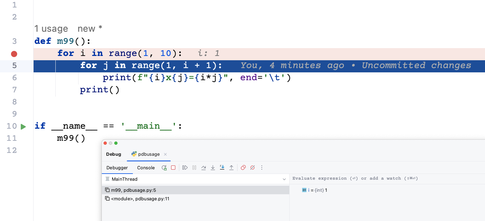

# 深入理解python虚拟机：调试器实现原理与源码分析

调试器是一个编程语言非常重要的部分，调试器是一种用于诊断和修复代码错误（或称为 bug）的工具，它允许开发者在程序执行时逐步查看和分析代码的状态和行为，它可以帮助开发者诊断和修复代码错误，理解程序的行为，优化性能。无论在哪种编程语言中，调试器都是一个强大的工具，对于提高开发效率和代码质量都起着积极的作用。

在本篇文章当中主要给大家介绍 python 语言当中调试器的实现原理，通过了解一个语言的调试器的实现原理我们可以更加深入的理解整个语言的运行机制，可以帮助我们更好的理解程序的执行。

## 让程序停下来

如果我们需要对一个程序进行调试最重要的一个点就是如果让程序停下来，只有让程序的执行停下来我们才能够观察程序执行的状态，比如我们需要调试 99 乘法表：

```python
def m99():
    for i in range(1, 10):
        for j in range(1, i + 1):
            print(f"{i}x{j}={i*j}", end='\t')
        print()


if __name__ == '__main__':
    m99()
```

现在执行命令 `python -m pdb pdbusage.py `  就可以对上面的程序进行调试：

```bash
(py3.8) ➜  pdb_test git:(master) ✗ python -m pdb pdbusage.py
> /Users/xxxx/Desktop/workdir/dive-into-cpython/code/pdb_test/pdbusage.py(3)<module>()
-> def m99():
(Pdb) s
> /Users/xxxx/Desktop/workdir/dive-into-cpython/code/pdb_test/pdbusage.py(10)<module>()
-> if __name__ == '__main__':
(Pdb) s
> /Users/xxxx/Desktop/workdir/dive-into-cpython/code/pdb_test/pdbusage.py(11)<module>()
-> m99()
(Pdb) s
--Call--
> /Users/xxxx/Desktop/workdir/dive-into-cpython/code/pdb_test/pdbusage.py(3)m99()
-> def m99():
(Pdb) s
> /Users/xxxx/Desktop/workdir/dive-into-cpython/code/pdb_test/pdbusage.py(4)m99()
-> for i in range(1, 10):
(Pdb) s
> /Users/xxxx/Desktop/workdir/dive-into-cpython/code/pdb_test/pdbusage.py(5)m99()
-> for j in range(1, i + 1):
(Pdb) s
> /Users/xxxx/Desktop/workdir/dive-into-cpython/code/pdb_test/pdbusage.py(6)m99()
-> print(f"{i}x{j}={i*j}", end='\t')
(Pdb) p i
1
(Pdb) 
```

当然你也可以在 IDE 当中进行调试：



根据我们的调试经历容易知道，要想调试一个程序首先最重要的一点就是程序需要在我们设置断点的位置要能够停下来

## cpython 王炸机制 —— tracing

现在的问题是，上面的程序是怎么在程序执行时停下来的呢？

根据前面的学习我们可以了解到，一个 python 程序的执行首先需要经过 python 编译器编译成 python 字节码，然后交给 python 虚拟机进行执行，如果需要程序停下来就一定需要虚拟机给上层的 python 程序提供接口，让程序在执行的时候可以知道现在执行到什么位置了。这个神秘的机制就隐藏在 sys 这个模块当中，事实上这个模块几乎承担了所有我们与 python 解释器交互的接口。实现调试器一个非常重要的函数就是 sys.settrace 函数，这个函数将为线程设置一个追踪函数，当虚拟机有函数调用，执行完一行代码的时候、甚至执行完一条字节码之后就会执行这个函数。

设置系统的跟踪函数，允许在 Python 中实现一个 Python 源代码调试器。该函数是线程特定的；为了支持多线程调试，必须对每个正在调试的线程注册一个跟踪函数，使用 settrace() 或者使用 threading.settrace() 。

跟踪函数应该有三个参数：frame、event 和 arg。frame 是当前的栈帧。event 是一个字符串：'call'、'line'、'return'、'exception'、 'opcode' 、'c_call' 或者  'c_exception'。arg 取决于事件类型。

**跟踪函数在每次进入新的局部作用域时被调用（事件设置为'call'）；它应该返回一个引用，用于新作用域的本地跟踪函数，或者如果不想在该作用域中进行跟踪，则返回None。**

如果在跟踪函数中发生任何错误，它将被取消设置，就像调用settrace(None)一样。

事件的含义如下：

- call，调用了一个函数（或者进入了其他代码块）。调用全局跟踪函数；arg 为 None；返回值指定了本地跟踪函数。

- line，将要执行一行新的代码，参数 arg 的值为 None 。

- return，函数（或其他代码块）即将返回。调用本地跟踪函数；arg 是将要返回的值，如果事件是由引发的异常引起的，则arg为None。跟踪函数的返回值将被忽略。

- exception，发生了异常。调用本地跟踪函数；arg是一个元组（exception，value，traceback）；返回值指定了新的本地跟踪函数。

- opcode，解释器即将执行新的字节码指令。调用本地跟踪函数；arg 为 None；返回值指定了新的本地跟踪函数。默认情况下，不会发出每个操作码的事件：必须通过在帧上设置 f_trace_opcodes 为 True 来显式请求。

- c_call，一个 c 函数将要被调用。

- c_exception，调用 c 函数的时候产生了异常。

## 自己动手实现一个简单的调试器

在本小节当中我们将实现一个非常简单的调试器帮助大家理解调试器的实现原理。调试器的实现代码如下所示，只有短短几十行却可以帮助我们深入去理解调试器的原理，我们先看一下实现的效果在后文当中再去分析具体的实现：

```python

import sys

file = sys.argv[1]
with open(file, "r+") as fp:
    code = fp.read()
lines = code.split("\n")


def do_line(frame, event, arg):
    print("debugging line:", lines[frame.f_lineno - 1])
    return debug


def debug(frame, event, arg):
    if event == "line":
        while True:
            _ = input("(Pdb)")
            if _ == 'n':
                return do_line(frame, event, arg)
            elif _.startswith('p'):
                _, v = _.split()
                v = eval(v, frame.f_globals, frame.f_locals)
                print(v)
            elif _ == 'q':
                sys.exit(0)
    return debug


if __name__ == '__main__':
    sys.settrace(debug)
    exec(code, None, None)
    sys.settrace(None)
```

在上面的程序当中使用如下：

- 输入 n 执行一行代码。
- p name 打印变量 name 。
- q 退出调试。

现在我们执行上面的程序，进行程序调试：

```bash
(py3.10) ➜  pdb_test git:(master) ✗ python mydebugger.py pdbusage.py
(Pdb)n
debugging line: def m99():
(Pdb)n
debugging line: if __name__ == '__main__':
(Pdb)n
debugging line:     m99()
(Pdb)n
debugging line:     for i in range(1, 10):
(Pdb)n
debugging line:         for j in range(1, i + 1):
(Pdb)n
debugging line:             print(f"{i}x{j}={i*j}", end='\t')
1x1=1   (Pdb)n
debugging line:         for j in range(1, i + 1):
(Pdb)p i
1
(Pdb)p j
1
(Pdb)q
(py3.10) ➜  pdb_test git:(master) ✗ 
```


可以看到我们的程序真正的被调试起来了。

现在我们来分析一下我们自己实现的简易版本的调试器，在前文当中我们已经提到了 sys.settrace 函数，调用这个函数时需要传递一个函数作为参数，被传入的函数需要接受三个参数：

- frame，当前正在执行的栈帧。
- event，事件的类别，这一点在前面的文件当中已经提到了。
- arg，参数这一点在前面也已经提到了。

- 同时需要注意的是这个函数也需要有一个返回值，python 虚拟机在下一次事件发生的时候会调用返回的这个函数，如果返回 None  那么就不会在发生事件的时候调用 tracing 函数了，这是代码当中为什么在 debug 返回 debug 的原因。

我们只对 line 这个事件进行处理，然后进行死循环，只有输入 n 指令的时候才会执行下一行，然后打印正在执行的行，这个时候就会退出函数 debug ，程序就会继续执行了。python 内置的 eval 函数可以获取变量的值。

## python 官方调试器源码分析

python 官方的调试器为 pdb 这个是 python 标准库自带的，我们可以通过 `python -m pdb xx.py` 去调试文件 xx.py 。这里我们只分析核心代码：

代码位置：bdp.py 下面的 Bdb 类

```python
    def run(self, cmd, globals=None, locals=None):
        """Debug a statement executed via the exec() function.

        globals defaults to __main__.dict; locals defaults to globals.
        """
        if globals is None:
            import __main__
            globals = __main__.__dict__
        if locals is None:
            locals = globals
        self.reset()
        if isinstance(cmd, str):
            cmd = compile(cmd, "<string>", "exec")
        sys.settrace(self.trace_dispatch)
        try:
            exec(cmd, globals, locals)
        except BdbQuit:
            pass
        finally:
            self.quitting = True
            sys.settrace(None)
```

上面的函数主要是使用 sys.settrace 函数进行 tracing 操作，当有事件发生的时候就能够捕捉了。在上面的代码当中 tracing 函数为 self.trace_dispatch 我们再来看这个函数的代码：

```python
    def trace_dispatch(self, frame, event, arg):
        """Dispatch a trace function for debugged frames based on the event.

        This function is installed as the trace function for debugged
        frames. Its return value is the new trace function, which is
        usually itself. The default implementation decides how to
        dispatch a frame, depending on the type of event (passed in as a
        string) that is about to be executed.

        The event can be one of the following:
            line: A new line of code is going to be executed.
            call: A function is about to be called or another code block
                  is entered.
            return: A function or other code block is about to return.
            exception: An exception has occurred.
            c_call: A C function is about to be called.
            c_return: A C function has returned.
            c_exception: A C function has raised an exception.

        For the Python events, specialized functions (see the dispatch_*()
        methods) are called.  For the C events, no action is taken.

        The arg parameter depends on the previous event.
        """
        if self.quitting:
            return # None
        if event == 'line':
            print("In line")
            return self.dispatch_line(frame)
        if event == 'call':
            print("In call")
            return self.dispatch_call(frame, arg)
        if event == 'return':
            print("In return")
            return self.dispatch_return(frame, arg)
        if event == 'exception':
            print("In execption")
            return self.dispatch_exception(frame, arg)
        if event == 'c_call':
            print("In c_call")
            return self.trace_dispatch
        if event == 'c_exception':
            print("In c_exception")
            return self.trace_dispatch
        if event == 'c_return':
            print("In c_return")
            return self.trace_dispatch
        print('bdb.Bdb.dispatch: unknown debugging event:', repr(event))
        return self.trace_dispatch
```

从上面的代码当中可以看到每一种事件都有一个对应的处理函数，在本文当中我们主要分析 函数 dispatch_line，这个处理 line 事件的函数。

```python
    def dispatch_line(self, frame):
        """Invoke user function and return trace function for line event.

        If the debugger stops on the current line, invoke
        self.user_line(). Raise BdbQuit if self.quitting is set.
        Return self.trace_dispatch to continue tracing in this scope.
        """
        if self.stop_here(frame) or self.break_here(frame):
            self.user_line(frame)
            if self.quitting: raise BdbQuit
        return self.trace_dispatch
```

这个函数首先会判断是否需要在当前行停下来，如果需要停下来就需要进入 user_line 这个函数，后面的调用链函数比较长，我们直接看最后执行的函数，根据我们使用 pdb 的经验来看，最终肯定是一个 while 循环让我们可以不断的输入指令进行处理：

```python
    def cmdloop(self, intro=None):
        """Repeatedly issue a prompt, accept input, parse an initial prefix
        off the received input, and dispatch to action methods, passing them
        the remainder of the line as argument.

        """
        print("In cmdloop")
        self.preloop()
        if self.use_rawinput and self.completekey:
            try:
                import readline
                self.old_completer = readline.get_completer()
                readline.set_completer(self.complete)
                readline.parse_and_bind(self.completekey+": complete")
            except ImportError:
                pass
        try:
            if intro is not None:
                self.intro = intro
            print(f"{self.intro = }")
            if self.intro:
                self.stdout.write(str(self.intro)+"\n")
            stop = None
            while not stop:
                print(f"{self.cmdqueue = }")
                if self.cmdqueue:
                    line = self.cmdqueue.pop(0)
                else:
                    print(f"{self.prompt = } {self.use_rawinput}")
                    if self.use_rawinput:
                        try:
                            # 核心逻辑就在这里 不断的要求输入然后进行处理
                            line = input(self.prompt) # self.prompt = '(Pdb)'
                        except EOFError:
                            line = 'EOF'
                    else:
                        self.stdout.write(self.prompt)
                        self.stdout.flush()
                        line = self.stdin.readline()
                        if not len(line):
                            line = 'EOF'
                        else:
                            line = line.rstrip('\r\n')

                line = self.precmd(line)
                stop = self.onecmd(line) # 这个函数就是处理我们输入的字符串的比如 p n 等等
                stop = self.postcmd(stop, line)
            self.postloop()
        finally:
            if self.use_rawinput and self.completekey:
                try:
                    import readline
                    readline.set_completer(self.old_completer)
                except ImportError:
                    pass
```

```python
    def onecmd(self, line):
        """Interpret the argument as though it had been typed in response
        to the prompt.

        This may be overridden, but should not normally need to be;
        see the precmd() and postcmd() methods for useful execution hooks.
        The return value is a flag indicating whether interpretation of
        commands by the interpreter should stop.

        """
        cmd, arg, line = self.parseline(line)
        if not line:
            return self.emptyline()
        if cmd is None:
            return self.default(line)
        self.lastcmd = line
        if line == 'EOF' :
            self.lastcmd = ''
        if cmd == '':
            return self.default(line)
        else:
            try:
                # 根据下面的代码可以分析了解到如果我们执行命令 p 执行的函数为 do_p
                func = getattr(self, 'do_' + cmd)
            except AttributeError:
                return self.default(line)
            return func(arg)
```

现在我们再来看一下 do_p 打印一个表达式是如何实现的：

```python
    def do_p(self, arg):
        """p expression
        Print the value of the expression.
        """
        self._msg_val_func(arg, repr)

    def _msg_val_func(self, arg, func):
        try:
            val = self._getval(arg)
        except:
            return  # _getval() has displayed the error
        try:
            self.message(func(val))
        except:
            self._error_exc()

    def _getval(self, arg):
        try:
            # 看到这里就破案了这不是和我们自己实现的 pdb 获取变量的方式一样嘛 都是
            # 使用当前执行栈帧的全局和局部变量交给 eval 函数处理 并且将它的返回值输出
            return eval(arg, self.curframe.f_globals, self.curframe_locals)
        except:
            self._error_exc()
            raise
```

## 总结

在本篇文章当中我们主要分析 python 当中实现调试器的原理，并且通过一个几十行的代码实现了一个非常简单的调试器，这可以深入帮助我们理解调试器实现的细节，这让我们对于程序设计语言的认识又加深了一点。最后简单的介绍了一下 python 自己的调试器 pdb，但是有一点遗憾的目前 pdb 还不能够支持直接调试 python 字节码，但是在 python 虚拟机当中已经有调试字节码的事件了，相信在未来应该可以直接调试字节码了。

还记得我们在讨论 frameobject 的时候有一个字段 f_trace 嘛，这个字段就是指向我们传递给 sys.settrace 的函数，当发生事件的时候虚拟机就会调用这个函数。

---

本篇文章是深入理解 python 虚拟机系列文章之一，文章地址：https://github.com/Chang-LeHung/dive-into-cpython

更多精彩内容合集可访问项目：<https://github.com/Chang-LeHung/CSCore>

关注公众号：一无是处的研究僧，了解更多计算机（Java、Python、计算机系统基础、算法与数据结构）知识。
