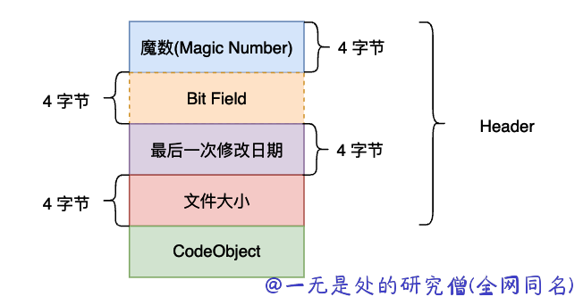

# 深入理解 python 虚拟机：破解核心魔法——反序列化 pyc 文件

在前面的文章当中我们详细的对于 pyc 文件的结构进行了分析，pyc 文件主要有下面的四个部分组成：魔术、 Bite Filed 、修改日期和 Code Object 组成。在前面的文章当中我们已经对前面三个部分进行了字节角度的分析，直接从 pyc 文件当中读取对应的数据并且打印出来了。而在本篇文章当中我们将主要对 Code Object 进行分析，并且详细它是如何被反序列化的，通过本篇文章我们将能够把握整个 pyc 文件结构。



## marshal 模块的魔力

### 序列化和反序列化 python 对象

marshal 是 python 自带的一个模块，他可以将一些 python 内置对象进行序列化和反序列化操作，甚至我们可以在一个文件当中序列话一个函数的 Code Object 对象，然后在另外一个文件反序列化这个 Code Object 对象并且执行它。

我们可以使用下面的代码将 python 当中的一些对象序列化操作，直接将 python 对边变成一个字节流，保存到磁盘当中：

```python
import marshal


if __name__ == '__main__':
    with open("pyobjects.bin", "wb") as fp:
        marshal.dump(1, fp)
        marshal.dump(1.5, fp)
        marshal.dump("Hello World", fp)
        marshal.dump((1, 2, 3), fp)
        marshal.dump([1, 2, 3], fp)
        marshal.dump({1, 2, 3}, fp)
        marshal.dump(1+1j, fp)
        marshal.dump({1: 2, 3: 4}, fp)
```

在上面的代码当中需要注意的是需要使用二进制方式 rb 打开文件，上面的程序执行完成之后会生成一个 pyobjects.bin 的二进制文件，我们可以使用 python 代码再将上面的 python 对象，比如整数、浮点数、字符串和列表元组等等反序列化出来。

```python
import marshal


if __name__ == '__main__':
    with open("pyobjects.bin", "rb") as fp:
        print(marshal.load(fp))
        print(marshal.load(fp))
        print(marshal.load(fp))
        print(marshal.load(fp))
        print(marshal.load(fp))
        print(marshal.load(fp))
        print(marshal.load(fp))
        print(marshal.load(fp))
```

上面的代码输出结果如下所示：

```python
1
1.5
Hello World
(1, 2, 3)
[1, 2, 3]
{1, 2, 3}
(1+1j)
{1: 2, 3: 4}
```

从上面代码的输出结果我们可以看到我们可以将所有的被写入到二进制文件当中的数据全部解析了出来。

### 序列化和反序列化 CodeObject

除了上面使用 marshal 对 python 的基本对象进行序列化和反序列化，我们可以使用 marshal 模块对 CodeObject 进行同样的操作，如果是这样的话，那么就可以将一个文件的代码序列化，然后另外一个程序反序列化再进行调用：

```python
import marshal


def add(a, b):
    print("Hello World")
    return a+b


with open("add.bin", "wb") as fp:
    marshal.dump(add.__code__, fp)
```

在上面的代码当中，我们打开了文件 `add.bin` 然后将 add 函数的 CodeObject 对象写入到文件当中去，而 CodeObject 当中保存了函数 add 的所有执行所需要的信息，因此我们可以在另外一个文件当中打开这个文件，然后将 CodeObject 对象反序列化出来在执行这个代码，我们看下面的代码：

```python
import marshal


def name():
    pass


with open("add.bin", "rb+") as fp:
    code = marshal.load(fp)
name.__code__ = code
print(name(1, 2))
```

上面的代码执行结果如下所示：

```bash
Hello World
3
```

可以看到反序列化之后的函数 add 复制到了 name 上，然后我们调用了函数 name 真的实现了打印和相加的效果，从这一点来看确实实现了我们在前面所提到的效果。

## Python 对象序列化

