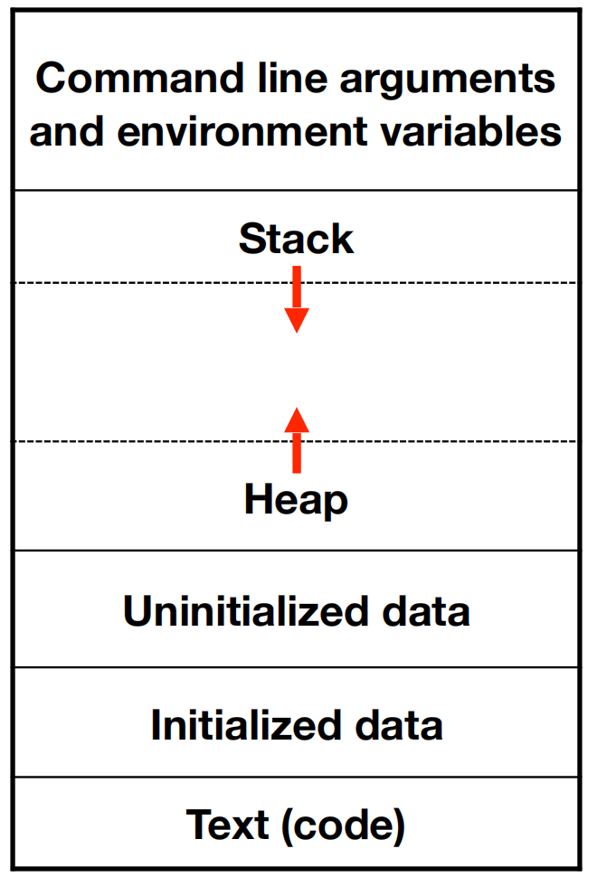

# 深入理解 Python 虚拟机：进程、线程和协程

在本篇文章当中深入分析在 Python 当中 进程、线程和协程的区别，这三个概念会让人非常迷惑。如果没有深入了解这三者的实现原理，只是看一些文字说明，也很难理解。在本篇文章当中我们将通过 CPython 虚拟机的源代码来详细分析一下这三者是如何实现的。

## 进程和线程

进程是一个非常古老的概念，根据 wiki 的描述，进程是一个正在执行的计算机程序，这里说的计算机程序是指的是能够直接被操作系统加载执行的程序，比如你通过编译器编译之后的 c/c++ 程序。

举个例子，你在 shell 当中敲出的 ./a.out 在按下回车之后，a.out 就会被执行起来，这个被操作系统执行的程序就是一个进程。在一个进程内部会有很多的资源，比如打开的文件，申请的内存，接收到的信号等等，这些信息都是由内核来维护。关于进程有一个非常重要的概念，就是进程的内存地址空间，一个进程当中主要有代码、数据、堆和执行栈：



这里我们不过多的去分析这一点，现在就需要知道在一个进程当中主要有这 4 个东西，而且在内核当中会有数据结构去保存他们。程序被操作系统加载之后可以被操作系统放到 CPU 上运行。我们可以同时启动多个进程，让操作系统去调度，而且随着体系结构的发展，现在的机器上都是多核机器，同时启动多个进程可以让他们同时执行。

在具体的编程时我们会有一个需求，我们希望并行的去执行程序，而且他们可以修改共有的内存，当一个进程修改之后能够被另外一个进程看到，从这个角度来说他们就需要有同一个地址空间，这样就可以实现这一点了，而且这种方式有一个好处就是节省内存资源，比如只需要保存一份内存的地址空间了。

上面谈到的实现进程的方式实际上被称作轻量级进程，也被叫做线程。具体来说就是可以在一个进程内部启动多个线程，这些线程之前有这相同的内存地址空间，这些线程能够同时被操作系统调度到不同的核心上同时执行。我们现在在 linux 上使用的线程是NPTL (Native POSIX Threads Library)，从 glibc2.3.2 开始支持，而且要求 linux 2.6 之后的特性。在前面的内容我们谈到了，在同一个进程内部的线程是可以共享一些进程拥有的数据的，比如：

-   进程号。
-   父进程号。
-   进程组号和会话号。
-   控制终端。
-   打开的文件描述符表。
-   当前工作目录。
-   虚拟地址空间。

在 linux 当中创建线程和进程的系统调用分别为 `clone` 和 `fork`，如果为了创建线程的话我们可以不使用这么低层级的 API，我们可以通过 NPTL 提供的 `pthread_create` 方法创建线程执行相应的方法。

```c
#include <stdio.h>
#include <pthread.h>

void* func(void* arg) {
  printf("Hello World\n");
  return NULL;
}

int main() {

  pthread_t t; // 定义一个线程
  pthread_create(&t, NULL, func, NULL); // 创建线程并且执行函数 func 

  // wait unit thread t finished
  pthread_join(t, NULL); // 主线程等待线程 t 执行完成然后主线程才继续往下执行

  printf("thread t has finished\n");
  return 0;
}
```

编译上述程序：

```shell
clang helloworld.c -o helloworld.out -lpthread
或者
gcc helloworld.c -o helloworld.out -lpthread
```

在上面的代码当中主线程（可以认为是执行主函数的线程）首先定义一个线程，然后创建线程并且执行函数 func ，当创建完成之后，主线程使用 pthread_join 阻塞自己，直到等待线程 t 执行完成之后主线程才会继续往下执行。

我们现在仔细分析一下 `pthread_create` 的函数签名，并且对他的参数进行详细分析：

```c
int pthread_create(pthread_t *thread, const pthread_attr_t *attr,
                          void *(*start_routine) (void *), void *arg);
```

-   参数 thread 是一个类型为 pthread_t 的指针对象，将这个对象会在 pthread_create 内部会被赋值为存放线程 id 的地址，在后文当中我们将使用一个例子仔细的介绍这个参数的含义。
-   参数 attr 是一个类型为 pthread_attr_t 的指针对象，我们可以在这个对象当中设置线程的各种属性，比如说线程取消的状态和类别，线程使用的栈的大小以及栈的初始位置等等，在后文当中我们将详细介绍这个属性的使用方法，当这个属性为 NULL 的时候，使用默认的属性值。
-   参数 start_routine 是一个返回类型为 void，参数类型为 void 的函数指针，指向线程需要执行的函数，线程执行完成这个函数之后线程就会退出。
-   参数 arg ，传递给函数 start_routine 的一个参数，在上一条当中我们提到了 start_routine 有一个参数，是一个 void 类型的指针，这个参数也是一个 void 类型的指针，在后文当中我们使用一个例子说明这个参数的使用方法。

在 Python 当中可以通过 threading 来创建一个线程：

```python
import threading

def func():
	print("Hello World")


if __name__ == '__main__':
	t = threading.Thread(target=func)
	t.start()
	t.join()
```

现在有一个问题是，在 Python 当中真的是使用 pthread_create 来创建线程的吗？Python 当中的线程和我们常说的线程是一致的吗？

我们现在来分析一下 threading 的源代码，线程的 start （也就是 Thread 类的方法）方法如下：

```python
    def start(self):
        if not self._initialized:
            raise RuntimeError("thread.__init__() not called")

        if self._started.is_set():
            raise RuntimeError("threads can only be started once")

        with _active_limbo_lock:
            _limbo[self] = self
        try:
            _start_new_thread(self._bootstrap, ())
        except Exception:
            with _active_limbo_lock:
                del _limbo[self]
            raise
        self._started.wait()
 
```

在上面的代码当中最核心的一行代码就是 `_start_new_thread(self._bootstrap, ())`，这行代码的含义是启动一个新的线程去执行 `self._bootstrap` ，在 `self._bootstrap` 当中会调用 `_bootstrap_inner`，在 `_bootstrap_inner` 当中会调用 Thread 的 run 方法，而在这个方法当中最终调用了我们传递给 Thread 类的函数。

```python
    def run(self):
        try:
            if self._target is not None:
                self._target(*self._args, **self._kwargs)
        finally:
            # Avoid a refcycle if the thread is running a function with
            # an argument that has a member that points to the thread.
            del self._target, self._args, self._kwargs

    def _bootstrap(self):
        try:
            self._bootstrap_inner()
        except:
            if self._daemonic and _sys is None:
                return
            raise

    def _bootstrap_inner(self):
        try:
            self._set_ident()
            self._set_tstate_lock()
            if _HAVE_THREAD_NATIVE_ID:
                self._set_native_id()
            self._started.set()
            with _active_limbo_lock:
                _active[self._ident] = self
                del _limbo[self]

            if _trace_hook:
                _sys.settrace(_trace_hook)
            if _profile_hook:
                _sys.setprofile(_profile_hook)

            try:
                self.run()
            except:
                self._invoke_excepthook(self)
        finally:
            self._delete()
```

现在的问题是 _start_new_thread 是如何实现的？这个方法是 CPython 内部使用 C 语言实现的方法，在这里我们不再将全部的细节进行分析，只讨论大致的流程。

在执行 _start_new_thread 时，最终会调用`PyThread_start_new_thread` 这个方法，第一个参数是一个函数，这个函数为 `t_bootstrap`，在`PyThread_start_new_thread` 当中会使用 `pthread_create` 创建一个新的线程执行 `t_bootstrap` 函数，在函数 `t_bootstrap` 当中会调用从 Python 层面当中传递过来的 `_bootstrap` 方法。

```c
long
PyThread_start_new_thread(void (*func)(void *), void *arg)
{
    pthread_t th;
    int status;
    pthread_attr_t attrs;
    size_t      tss;

    if (!initialized)
        PyThread_init_thread();

    if (pthread_attr_init(&attrs) != 0)
        return -1;
    tss = (_pythread_stacksize != 0) ? _pythread_stacksize
                                     : THREAD_STACK_SIZE;
    if (tss != 0) {
        if (pthread_attr_setstacksize(&attrs, tss) != 0) {
            pthread_attr_destroy(&attrs);
            return -1;
        }
    }
    pthread_attr_setscope(&attrs, PTHREAD_SCOPE_SYSTEM);

    status = pthread_create(&th,
                             &attrs,
                             (void* (*)(void *))func,
                             (void *)arg
                             ); // 创建新线程执行函数 func，也就是传递过来的函数 t_bootstrap（函数内容见下方）
    // 在执行完上面的代码之后线程就会立即执行了不需要像 Python 当中的线程一样需要调用 start
    pthread_attr_destroy(&attrs);
    if (status != 0)
        return -1;

    pthread_detach(th);

    return (long) th;
}

static void
t_bootstrap(void *boot_raw)
{
    struct bootstate *boot = (struct bootstate *) boot_raw;
    PyThreadState *tstate;
    PyObject *res;

    tstate = boot->tstate;
    tstate->thread_id = PyThread_get_thread_ident();
    _PyThreadState_Init(tstate);
    PyEval_AcquireThread(tstate);
    nb_threads++;
    // boot->func 就是从 Python 层面传递过来的 _bootstrap 
    // PyEval_CallObjectWithKeywords 就是调用 Python 层面的函数
    // 下面这行代码就是在创建线程后执行的 Python 代码
    res = PyEval_CallObjectWithKeywords(
        boot->func, boot->args, boot->keyw);
    if (res == NULL) {
        if (PyErr_ExceptionMatches(PyExc_SystemExit))
            PyErr_Clear();
        else {
            PyObject *file;
            PySys_WriteStderr(
                "Unhandled exception in thread started by ");
            file = PySys_GetObject("stderr");
            if (file != NULL && file != Py_None)
                PyFile_WriteObject(boot->func, file, 0);
            else
                PyObject_Print(boot->func, stderr, 0);
            PySys_WriteStderr("\n");
            PyErr_PrintEx(0);
        }
    }
    else
        Py_DECREF(res);
    Py_DECREF(boot->func);
    Py_DECREF(boot->args);
    Py_XDECREF(boot->keyw);
    PyMem_DEL(boot_raw);
    nb_threads--;
    PyThreadState_Clear(tstate);
    PyThreadState_DeleteCurrent();
    PyThread_exit_thread();
}
```

从上面的整个创建线程的流程来看，当我们在 Python 层面创建一个线程之后，最终会调用 `pthread_create` 函数，真正创建一个线程（我们在前面已经讨论过这种线程能够被操作系统调度在 CPU 上运行，如果是多核机器的话，这两个线程可以在同一个时刻运行）去执行相应的 Python 代码。

## 协程

Coroutines are computer program components that allow execution to be suspended and resumed, generalizing subroutines for cooperative multitasking.

根据 wiki 的描述，协程是一个允许停下来和恢复执行的程序。在 Python 当中协程是基于生成器实现的（如果想具体了解生成器和协程的实现原理，可以参考这两篇文章 [深入理解 Python 虚拟机：协程初探——不过是生成器而已](https://github.com/Chang-LeHung/dive-into-cpython/blob/master/pvm/14coroutine.md) 和 [深入理解 Python 虚拟机：生成器停止背后的魔法](https://github.com/Chang-LeHung/dive-into-cpython/blob/master/pvm/10generator.md)），因为生成器是满足这个要求的，他可以让程序执行到函数的某一部分停下来，然后还能够继续恢复执行。

在继续分析协程之前我们来讨论一下协程的应用场景。现在假如需要处理很多网络请求，一个线程处理一个请求，当处理一个请求的时候我们需要等待客户端的响应，线程在等待客户端响应的时候是处于阻塞状态不需要使用 CPU，假设 CPU 的使用率为 0.0001%，那么我们大概需要 1000000 个线程才能够将 CPU 的使用率达到 100%，而通常我们在内核创建一个线程大概需要 2MB 的内存，4GB 内存大概能够创建 2048 个线程，这远远达不到我们需要创建的线程个数。而我们可以通过创建协程来达到这一点要求，因为协程需要的内存比线程小的多，而且协程是在用户态实现的，不同的编程语言可以根据语言本身的情况进行实现。而我们在前面说明了一个线程可以被挂起，挂起之后也可以被继续执行，我们可以利用这一点，当协程发送一个网络请求之后就被挂起，这个时候切换到其他协程继续执行，这样就可以让一个线程充分利用 CPU 的资源。对应的伪代码如下：

```python

def recv(socket):
  while True:
    try:
      data = socket.recv() # 接收到数据了
    	return data
    except BlockingIOError:
      yield # 让出 CPU 的执行权，也就是将协程暂停，让其他协程运行起来
```

在 Python 当中和协程非常相关的另外一个概念就是事件循环 (Eventloop)，我们将需要运行的协程都加入到事件循环当中，当有协程让出 CPU 的执行权的之后，整个程序的流程就退回到了事件循环上，此时事件循环再运行另外一个协程，这样就能够充分利用 CPU 的性能了。时间循环的执行流程大致如下所示：

```python
def event_loop():
  coroutines = [...]
  while coroutines.is_not_empty():
    coroutine = get_a_coroutine(coroutines)
    res = coroutine.run()
    if coroutine.is_not_finished():
      append(coroutines)
```


